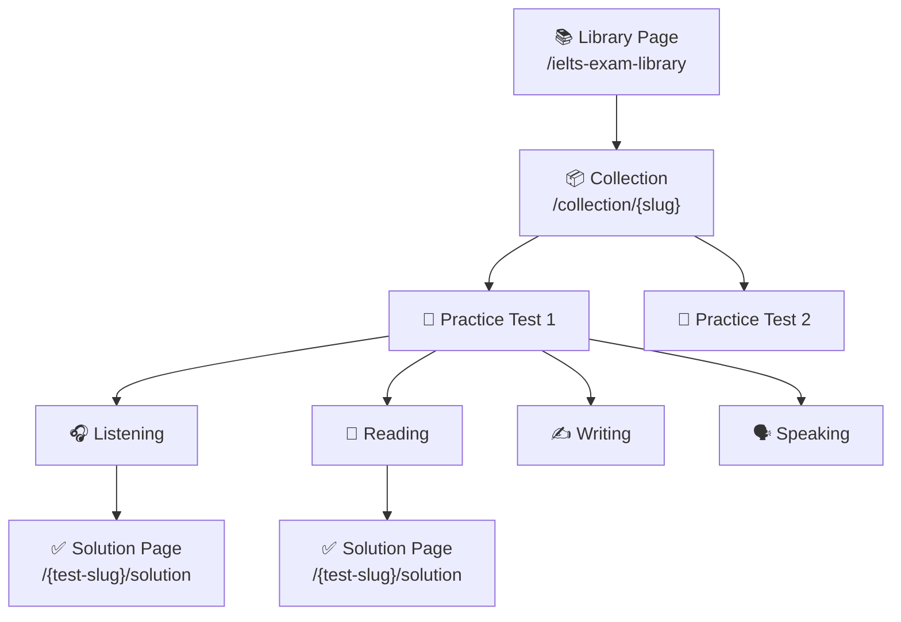
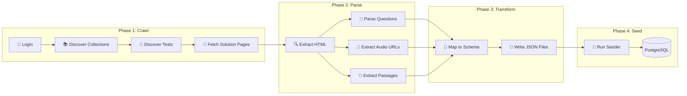

# 🕷️ Scraping Plan: ieltsonlinetests.com → IELTS Intensive

## Overview

Scrape IELTS mock test data from [ieltsonlinetests.com/ielts-exam-library](https://ieltsonlinetests.com/ielts-exam-library) and transform it into seed JSON files matching your existing `IeltsPracticeListeningPart` / `IeltsPracticeReadingPart` schema.

---

## 1. Site Structure (Discovered)



| Level | URL Pattern | Example |
|-------|-------------|---------|
| Library | `/ielts-exam-library?page={0,1,2}` | 3 pages, ~50+ collections |
| Collection | `/collection/{slug}` | `ielts-mock-test-2025-january` |
| Skill Test | `/{test-slug}` | `ielts-mock-test-2025-january-listening-practice-test-1` |
| Solution | `/{test-slug}/solution` | Contains questions + answers |

> [!IMPORTANT]
> **Login is required** to access test content and solution pages. Unauthenticated requests redirect to `/account/login`.

---

## 2. Data Available per Skill

### Listening (Target: `IeltsPracticeListeningPart`)
| Source Field | Target DB Field | Notes |
|---|---|---|
| Audio player `<source>` | `audioUrl` | MP3/OGG file, usually CDN-hosted |
| Question groups | `content` (Json) | Mixed types: form_completion, multiple_choice, matching, etc. |
| Transcript (if visible) | `transcript` (Json) | Speaker + text segments |
| Question numbers | Embedded in `content` | 10 questions per part × 4 parts |
| Part dividers | `partNumber` | 1-4 per full test |

### Reading (Target: `IeltsPracticeReadingPart`)
| Source Field | Target DB Field | Notes |
|---|---|---|
| Passage text | `passage` (Text) | Full reading passage |
| Annotated passage | `passageWithLocations` (Json) | Text segments with question anchors |
| Question groups | `content` (Json) | true_false_not_given, note_completion, matching_headings, etc. |
| Part dividers | `partNumber` | 1-3 per full test |

### Writing (Target: `IeltsWritingExercise` — future)
| Source Field | Target DB Field | Notes |
|---|---|---|
| Task prompt | `prompt` | Task 1 (chart/diagram) or Task 2 (essay) |
| Diagram/Image | `diagramUrl` | For Task 1 |
| Model answer | `modelAnswer` | If available on solution page |

### Speaking (Target: future model)
| Source Field | Notes |
|---|---|
| Part 1/2/3 prompts | Cue cards, follow-up questions |
| Model answers | If available |

---

## 3. Technical Architecture



---

## 4. Tooling Choice

### Recommended: **Playwright (Python)** + **BeautifulSoup**

| Tool | Purpose | Why |
|------|---------|-----|
| **Playwright** | Browser automation, login, JS-rendered pages | Handles anti-bot, cookies, dynamic content |
| **BeautifulSoup** | HTML parsing after page load | Lightweight, precise DOM extraction |
| **Python** | Scripting language | Your AI backend already uses Python |

> [!TIP]
> Store scripts in `backend-core/prisma/scripts/scraper/` alongside your existing `fetch-pronunciation-audio.ts` pattern.

### Directory Structure
```
backend-core/prisma/scripts/scraper/
├── requirements.txt          # playwright, beautifulsoup4, lxml
├── config.py                 # Constants: BASE_URL, CREDENTIALS, DELAYS
├── 01_login.py               # Authenticate + save session cookies
├── 02_discover_collections.py # Crawl library pages → collection URLs
├── 03_discover_tests.py      # Crawl collections → individual test URLs
├── 04_scrape_listening.py    # Parse Listening solution pages → JSON
├── 05_scrape_reading.py      # Parse Reading solution pages → JSON
├── 06_scrape_writing.py      # Parse Writing solution pages → JSON (future)
├── 07_download_audio.py      # Download audio files to local/CDN
├── transform/
│   ├── to_listening_json.py  # Transform raw → IeltsPracticeListeningPart schema
│   └── to_reading_json.py    # Transform raw → IeltsPracticeReadingPart schema
└── output/
    ├── raw/                  # Raw scraped HTML/JSON
    └── compiled/             # Final JSON files for seeding
```

---

## 5. Implementation Phases

### Phase 1: Authentication & Discovery (Day 1)

```python
# config.py
BASE_URL = "https://ieltsonlinetests.com"
LOGIN_URL = f"{BASE_URL}/account/login"
LIBRARY_URL = f"{BASE_URL}/ielts-exam-library"

# Rate limiting
REQUEST_DELAY_SECONDS = 2  # Be respectful
MAX_CONCURRENT = 1         # Sequential only
```

**Steps:**
1. Create a free account on ieltsonlinetests.com
2. Use Playwright to automate login, save cookies/session
3. Crawl `/ielts-exam-library?page={0,1,2}` → extract all collection URLs
4. For each collection, extract individual test URLs per skill

**Output:** `output/raw/test_urls.json`
```json
{
  "collections": [
    {
      "slug": "ielts-mock-test-2025-january",
      "name": "IELTS Mock Test 2025 January",
      "tests": [
        {
          "practice_test": 1,
          "listening": "/ielts-mock-test-2025-january-listening-practice-test-1",
          "reading": "/ielts-mock-test-2025-january-reading-practice-test-1",
          "writing": "/ielts-mock-test-2025-january-writing-practice-test-1",
          "speaking": "/ielts-mock-test-2025-january-speaking-practice-test-1"
        }
      ]
    }
  ]
}
```

### Phase 2: Scrape Listening Tests (Day 2-3)

**For each listening test URL:**
1. Navigate to `/{test-slug}/solution`
2. Extract:
   - Audio URL from `<audio>` / `<source>` elements
   - Part boundaries (Part 1-4 dividers)
   - Question groups with type detection
   - Correct answers
   - Transcript if available

**Key HTML patterns to look for:**
```
- Audio:  <audio><source src="...mp3"></audio>
- Parts:  <h2>Part 1</h2> or <div class="part-header">
- Questions: <div class="question-group"> or similar containers
- Answers: Highlighted correct answers on solution page
- Transcript: <div class="transcript"> (may be toggleable)
```

**Output schema must match your existing format:**
```json
[
  {
    "questions": "1-10",
    "topic": "Planning a Cousins' Family Trip",
    "question_type": "Note Completion",
    "audio_url": "https://..../Cam20-T4-P1.mp3",
    "transcript": [
      { "speaker": "MAN", "text": "...", "question_number": 1, "highlight_text": "..." }
    ],
    "content": [
      {
        "type": "form_completion",
        "heading": "...",
        "points": [
          {
            "question_number": 1,
            "text": "...",
            "answer": "Kings",
            "timestamp_seconds": 73,
            "explanation": "..."
          }
        ]
      }
    ]
  }
]
```

> [!WARNING]
> **`timestamp_seconds` and `explanation`** are NOT available on the source site. You'll need to either:
> - Omit them (your frontend should handle nulls)
> - Generate explanations via AI (GPT/Gemini) in a post-processing step
> - Add timestamps manually or skip them

### Phase 3: Scrape Reading Tests (Day 3-4)

**For each reading test URL:**
1. Navigate to `/{test-slug}/solution`
2. Extract:
   - Full passage text
   - Question groups with type detection
   - Correct answers
   - Build `passage_with_locations` by cross-referencing answers with passage text

**Output schema must match:**
```json
[
  {
    "title": "The development of the London underground railway",
    "passage": "...",
    "passage_with_locations": [
      "text segment...",
      { "question_number": 1, "text": "population" },
      "more text..."
    ],
    "content": [
      {
        "type": "note_completion",
        "instruction": "Complete the notes below...",
        "questions": [
          { "question_number": 1, "answer": "population" }
        ],
        "notes": [...]
      },
      {
        "type": "true_false_not_given",
        "instruction": "Do the following statements...",
        "questions": [
          { "question_number": 7, "answer": "FALSE", "text": "..." }
        ]
      }
    ]
  }
]
```

### Phase 4: Audio Download & CDN Upload (Day 4)

1. Download all audio files from the scraped URLs
2. Upload to your existing CDN/storage (DigitalOcean Spaces or MinIO)
3. Update JSON files with your own CDN URLs

### Phase 5: Transform & Seed (Day 5)

1. Run transform scripts to ensure all JSON matches schema exactly
2. Place compiled JSON files in `backend-core/prisma/data/ielts-intensive-compiled/`
3. Create a new seeder: `backend-core/prisma/seeders/ielts-intensive.seeder.ts`
4. Model after existing [ielts-advanced.seeder.ts](file:///c:/Users/Admin/Desktop/thesis/merge/thesis-toeic-system/backend-core/prisma/seeders/ielts-advanced.seeder.ts)

---

## 6. Question Type Detection Map

Based on your existing component registry, map scraped question types to your `type` field:

| IOT Site Question Type | Your `content[].type` | Skills |
|---|---|---|
| Form/Note completion | `form_completion` / `note_completion` | L, R |
| Multiple choice (single) | `multiple_choice` | L, R |
| Multiple choice (multi) | `multiple_choice_multiple` | L, R |
| Matching | `matching` | L, R |
| Map/Diagram labelling | `map_labelling` | L |
| True/False/Not Given | `true_false_not_given` | R |
| Yes/No/Not Given | `yes_no_not_given` | R |
| Matching headings | `matching_headings` | R |
| Sentence completion | `sentence_completion` | R |
| Summary completion | `summary_completion` | R |
| Matching information | `matching_information` | R |
| Short answer | `short_answer` | L, R |

---

## 7. Estimated Data Volume

| Year | Collections | Tests per Collection | Total Tests | L Parts | R Parts |
|------|-------------|---------------------|-------------|---------|---------|
| 2022 | 12 | ~2 each | ~24 | ~96 | ~72 |
| 2023 | 12 | ~2 each | ~24 | ~96 | ~72 |
| 2024 | 11 | ~2 each | ~22 | ~88 | ~66 |
| 2025 | 11 | ~2 each | ~22 | ~88 | ~66 |
| **Total** | **~46** | | **~92** | **~368** | **~276** |

> Currently you have **4 listening parts** and **3 reading parts**. This would increase to **300-600+ parts**.

---

## 8. Rate Limiting & Ethics

> [!CAUTION]
> **Scraping must be done responsibly.**

| Rule | Implementation |
|------|---------------|
| Rate limiting | `time.sleep(2)` between requests minimum |
| Respect robots.txt | Check `https://ieltsonlinetests.com/robots.txt` first |
| No concurrent scraping | Single-threaded sequential crawl |
| Personal use only | Data is for your thesis project, not redistribution |
| Session reuse | Login once, reuse cookies across requests |
| Error handling | Retry with exponential backoff on 429/503 |
| Checkpointing | Save progress so you can resume if interrupted |

---

## 9. Risk & Mitigation

| Risk | Impact | Mitigation |
|------|--------|-----------|
| Site blocks scraper | 🔴 High | Use Playwright (real browser), human-like delays, rotate user agents |
| Login session expires | 🟡 Medium | Re-authenticate automatically when 401/redirect detected |
| HTML structure changes | 🟡 Medium | Use robust CSS selectors, add fallback patterns |
| Audio URLs expire | 🟡 Medium | Download audio files immediately, host on your CDN |
| Missing transcripts | 🟢 Low | Not all tests have visible transcripts; make field optional |
| Missing explanations | 🟢 Low | Use AI to generate explanations in post-processing |

---

## 10. Quick Start Commands

```bash
# 1. Set up scraper environment
cd backend-core/prisma/scripts/scraper
python -m venv venv
venv\Scripts\activate       # Windows
pip install playwright beautifulsoup4 lxml
playwright install chromium

# 2. Run discovery
python 01_login.py
python 02_discover_collections.py
python 03_discover_tests.py

# 3. Run scraping
python 04_scrape_listening.py
python 05_scrape_reading.py

# 4. Transform & seed
python transform/to_listening_json.py
python transform/to_reading_json.py

# 5. Seed database
cd ../../../
npx ts-node prisma/seeders/ielts-intensive.seeder.ts
```

---

## 11. Open Questions for You

1. **Scope:** Do you want all years (2022-2025) or just specific ones (e.g., 2025 only)?
2. **Skills:** Focus on Listening + Reading only (matching current models), or also Writing/Speaking?
3. **Audio hosting:** Download audio to your own CDN, or keep original URLs?
4. **Explanations:** Generate via AI, or leave them null for now?
5. **Test type:** Academic only, General Training only, or both?
