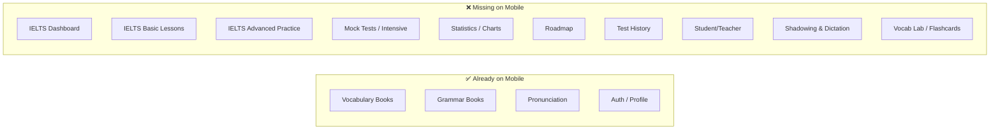
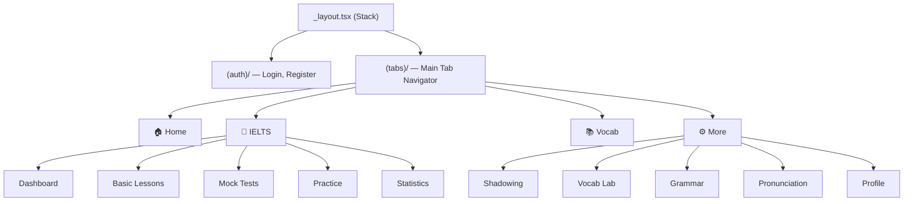

# Plan: Lexon Web → Mobile App

## Current State Assessment

### What Already Exists in `frontend-mobile/`

| Layer | Status | Details |
|---|---|---|
| **Framework** | ✅ Set up | Expo SDK 52, React Native 0.76, Expo Router 4 (file-based routing) |
| **Auth** | ✅ Done | `AuthContext`, login/register screens, token management via AsyncStorage |
| **API client** | ✅ Done | `api-client.ts` with token injection, base URL config |
| **Foundation modules** | ✅ Done | Vocabulary books/units, Grammar books/units, Pronunciation sounds |
| **Tab navigation** | ✅ Done | 5 tabs: Home, Vocabulary, Grammar, Pronunciation, Profile |
| **Shared components** | ⚠️ Minimal | Only `Card`, `ErrorView`, `LoadingSpinner` |

### What the Web App Has (That Mobile Lacks)

The web has **12 major feature areas** under `/ielts/`. These are the core IELTS training features that need mobile equivalents:



---

## Strategy: Incremental Build on Existing Expo Codebase

> [!IMPORTANT]
> **Do NOT rewrite from scratch.** The mobile project already has a working Expo Router shell, auth, and API layer. The strategy is to add new screens/tabs incrementally, reusing the existing backend API unchanged.

### Why This Approach

- The **backend is 100% reusable** — all REST endpoints already serve JSON; no backend changes needed.
- The mobile `api-client.ts` already handles auth tokens, base URL, and error handling.
- Expo Router uses the **same file-based routing paradigm** as Next.js, so the mental model transfers directly.
- Each web page can be mapped 1:1 to a mobile screen, with UI translated from HTML/CSS → React Native `View`/`Text`/`StyleSheet`.

---

## Phase-by-Phase Implementation

### Phase 0: Infrastructure Upgrades (1–2 days)

Before building screens, shore up the mobile foundation:

| Task | Details |
|---|---|
| **Add missing dependencies** | `react-native-svg` (for charts), `expo-audio` (listening), `react-native-webview` (reading passages), `@expo/vector-icons` (replace emoji tab icons) |
| **Create shared UI kit** | `Button`, `Badge`, `TabBar`, `ProgressBar`, `EmptyState`, `SkillIcon` components |
| **Expand API services** | Add `ieltsApi`, `examsApi`, `statisticsApi`, `shadowingApi`, `vocabLabApi` matching web service files |
| **Add GradingContext** | Port from web — manages async Writing/Speaking grading via the AI backend |
| **Theming** | Expand `constants/colors.ts` to match web's slate-based palette |

### Phase 1: IELTS Core — Dashboard + Onboarding (3–4 days)

**Web source**: `/ielts/dashboard`, `/ielts/basic/onboarding`

| Mobile screen | Route | Key UI elements |
|---|---|---|
| IELTS Hub | `app/(tabs)/ielts.tsx` | Add a new tab; skill cards (L/R/W/S), estimated band, streak badge |
| Onboarding flow | `app/ielts/onboarding.tsx` | Target band picker, daily commitment slider, placement quiz |
| Diagnostic Quiz | `app/ielts/onboarding/quiz.tsx` | MCQ quiz → placement score → profile creation |

**API endpoints** (already exist):
- `POST /ielts/profile` — create profile
- `GET /ielts/profile` — fetch profile
- `PATCH /ielts/profile` — update settings

### Phase 2: IELTS Basic Lessons (3–4 days)

**Web source**: `/ielts/basic/[skill]`, `/ielts/basic/library`

| Mobile screen | Route | Notes |
|---|---|---|
| Skill lessons list | `app/ielts/basic/[skill].tsx` | Listening/Reading/Writing lesson cards |
| Lesson detail | `app/ielts/basic/[skill]/[lessonId].tsx` | Content blocks renderer (text, audio, quiz) |
| Listening exercise | `app/ielts/basic/listening/[id].tsx` | Audio player + form completion / MCQ |
| Reading exercise | `app/ielts/basic/reading/[id].tsx` | Passage + question groups |
| Writing exercise | `app/ielts/basic/writing/[id].tsx` | Prompt + text input + AI grading |

**Complexity note**: The lesson content is stored as JSON arrays of typed blocks. Build a `ContentBlockRenderer` component that handles `text`, `heading`, `list`, `tip`, `example`, `table`, `quiz` block types — same as the web renderer but with React Native primitives.

### Phase 3: Mock Tests — Intensive Module (5–7 days) ⭐ Highest priority

**Web source**: `/ielts/intensive`, `/ielts/intensive/[examId]`

This is the exam engine — the most complex and highest-value feature.

| Mobile screen | Route | Notes |
|---|---|---|
| Test catalog | `app/ielts/intensive/index.tsx` | Cambridge test groups grid, skill tabs (L/R/W/S) |
| Exam player | `app/ielts/intensive/[examId].tsx` | Timer, question navigation, audio playback, answer input |
| Result review | `app/ielts/intensive/[examId]/result/[sessionId].tsx` | Score breakdown, correct/wrong per question, band score |

**Key technical challenges**:
- **Audio playback**: Use `expo-av` for listening tests. The web uses `<audio>` tags; mobile needs `Audio.Sound` objects.
- **Timer**: Background timer that works even when app is backgrounded (use `expo-task-manager` or in-memory).
- **Question types**: MCQ, form completion, matching, map labelling, table fill — each needs a native input component.
- **Session persistence**: Save progress to backend via `PATCH /exams/sessions/:id/progress` so users can resume.

### Phase 4: Advanced Practice (3–4 days)

**Web source**: `/ielts/advanced/listening`, `/ielts/advanced/reading`

| Mobile screen | Route | Notes |
|---|---|---|
| Parts catalog | `app/ielts/advanced/[skill].tsx` | List of practice parts by question type |
| Part player | `app/ielts/advanced/[skill]/[partId].tsx` | Audio + questions (reuse question components from Phase 3) |
| My answers | `app/ielts/advanced/[skill]/[partId]/my-answers/[id].tsx` | Review submitted answers vs correct |

### Phase 5: Statistics + History (2–3 days)

**Web source**: `/ielts/statistics`, `/ielts/history`

| Mobile screen | Route | Notes |
|---|---|---|
| Statistics dashboard | `app/ielts/statistics.tsx` | Band score charts (use `react-native-svg`), profile summary, streak |
| Test history | `app/ielts/history.tsx` | Flat list of completed tests with band scores |
| History detail | `app/ielts/history/[sessionId].tsx` | Reuse result review from Phase 3 |

**Charts**: Translate the SVG-based `BandScoreChart` to use `react-native-svg` directly — the viewBox/path logic is identical, just swap `<svg>` for `<Svg>` from `react-native-svg`.

### Phase 6: Shadowing & Dictation (3–4 days)

**Web source**: `/shadowing-dictation`

| Mobile screen | Route | Notes |
|---|---|---|
| Lesson browser | `app/shadowing/index.tsx` | YouTube video list, folders |
| Practice player | `app/shadowing/[id].tsx` | Video player (WebView for YouTube), sentence-by-sentence practice |
| My videos | `app/shadowing/my-videos.tsx` | User-uploaded video management |

**Complexity note**: YouTube playback on mobile requires `react-native-youtube-iframe` or a WebView wrapper. The sentence-level audio sync logic is the same as web.

### Phase 7: Vocab Lab / Flashcards (2–3 days)

**Web source**: `/vocab-lab`

| Mobile screen | Route | Notes |
|---|---|---|
| Deck list | `app/vocab-lab/index.tsx` | User's flashcard decks with due counts |
| Study session | `app/vocab-lab/study/[deckId].tsx` | Card flip animation, Again/Hard/Good/Easy buttons (FSRS) |
| Deck management | `app/vocab-lab/[deckId].tsx` | Add/edit/delete cards, card type selection |

### Phase 8: Roadmap + Student/Teacher (1–2 days)

**Web source**: `/ielts/roadmap`, `/ielts/student-teacher`

| Mobile screen | Route | Notes |
|---|---|---|
| Roadmap | `app/ielts/roadmap.tsx` | Linear progress tracker — simpler than web sidebar |
| Student/Teacher | `app/ielts/student-teacher.tsx` | Link teacher by ID, view linked students/teachers |
| Student stats | `app/ielts/student-teacher/[studentId].tsx` | Reuse `StatisticsContent` equivalent |

---

## Architecture Mapping

### Web → Mobile Component Translation

| Web (HTML/CSS) | Mobile (React Native) |
|---|---|
| `<div>` | `<View>` |
| `<p>`, `<span>`, `<h1>` | `<Text>` with style variants |
| `<input>` | `<TextInput>` |
| `<button>` | `<TouchableOpacity>` or `<Pressable>` |
| `<table>` | `<FlatList>` with row components |
| `<svg>` charts | `react-native-svg` (`<Svg>`, `<Path>`, `<Circle>`) |
| `<audio>` | `expo-av` `Audio.Sound` |
| CSS classes | `StyleSheet.create()` |
| `overflow-y-auto` | `<ScrollView>` or `<FlatList>` |
| `Link` (next/link) | `Link` (expo-router) or `router.push()` |
| `localStorage` | `AsyncStorage` |
| `fetch` / `axios` | Same (React Native supports `fetch`) |

### Navigation Architecture



> [!TIP]
> Reorganize the current 5-tab layout into **4 tabs**: Home, IELTS (new hub tab), Vocab (books + lab), More (grammar, pronunciation, shadowing, profile, settings). This prevents tab overflow and puts the IELTS features front and center.

---

## File Structure (Proposed)

```
frontend-mobile/
├── app/
│   ├── _layout.tsx                    # Root Stack
│   ├── index.tsx                      # Redirect → (tabs) or (auth)
│   ├── (auth)/
│   │   ├── login.tsx
│   │   └── register.tsx
│   ├── (tabs)/
│   │   ├── _layout.tsx                # 4-tab navigator
│   │   ├── index.tsx                  # Home (streak, quick actions)
│   │   ├── ielts.tsx                  # IELTS Hub
│   │   ├── vocab.tsx                  # Vocabulary + Flashcards
│   │   └── more.tsx                   # Grammar, Pronunciation, Settings
│   ├── ielts/
│   │   ├── onboarding/
│   │   ├── basic/
│   │   ├── intensive/
│   │   ├── advanced/
│   │   ├── statistics.tsx
│   │   ├── history.tsx
│   │   ├── roadmap.tsx
│   │   └── student-teacher/
│   ├── shadowing/
│   ├── vocab-lab/
│   ├── vocabulary/
│   └── grammar/
├── components/
│   ├── ui/                            # Button, Badge, Card, Modal, etc.
│   ├── ielts/                         # Question renderers, audio player
│   ├── charts/                        # BandScoreChart (SVG)
│   └── index.ts
├── services/
│   ├── api-client.ts                  # (existing)
│   ├── auth.service.ts                # (existing)
│   ├── api.ts                         # (existing — vocab, grammar, pronunciation)
│   ├── ielts.api.ts                   # NEW
│   ├── exams.api.ts                   # NEW
│   ├── statistics.api.ts              # NEW
│   ├── shadowing.api.ts               # NEW
│   └── vocab-lab.api.ts               # NEW
├── contexts/
│   ├── AuthContext.tsx                 # (existing)
│   └── GradingContext.tsx             # NEW
├── constants/
├── hooks/
├── types/
└── assets/
```

---

## Effort Estimate

| Phase | Scope | Effort | Cumulative |
|---|---|---|---|
| **0** | Infrastructure | 1–2 days | 2 days |
| **1** | Dashboard + Onboarding | 3–4 days | 6 days |
| **2** | Basic Lessons | 3–4 days | 10 days |
| **3** | Mock Tests ⭐ | 5–7 days | 17 days |
| **4** | Advanced Practice | 3–4 days | 21 days |
| **5** | Statistics + History | 2–3 days | 24 days |
| **6** | Shadowing & Dictation | 3–4 days | 28 days |
| **7** | Vocab Lab | 2–3 days | 31 days |
| **8** | Roadmap + Student/Teacher | 1–2 days | 33 days |
| | **Polish, testing, deployment** | 3–5 days | **~38 days** |

> [!NOTE]
> These estimates assume a single developer working full time. The phases are independent enough to parallelize if more people are available.

---

## What Does NOT Need to Change

| Layer | Reason |
|---|---|
| **Backend (NestJS)** | All REST APIs return JSON — fully reusable |
| **Database (Prisma)** | No schema changes needed |
| **AI grading pipeline** | RabbitMQ + AI service — operates independently |
| **Auth flow** | JWT-based — already implemented on mobile |
| **Data models** | Same `types/` definitions can be shared |

---

## Key Risks & Mitigations

> [!WARNING]
> **Audio playback reliability**: IELTS Listening tests depend on accurate audio playback with seeking. `expo-av` handles this, but test thoroughly on both iOS and Android for streaming audio from the backend.

> [!WARNING]
> **Large exam JSON payloads**: Some exams have 40+ questions with complex nested JSON. Ensure the mobile API client handles large responses without timeout. Consider adding pagination to the exam history endpoint if needed.

> [!CAUTION]
> **YouTube embedding**: Shadowing uses YouTube videos. `react-native-youtube-iframe` works but has platform-specific quirks (Android fullscreen, iOS autoplay policies). Budget extra time for this module.

> [!TIP]
> **Start with Phase 3 (Mock Tests)** if thesis deadline is tight — it's the highest-value feature and demonstrates the full exam workflow on mobile. The onboarding (Phase 1) can be deferred by hardcoding a test profile.
