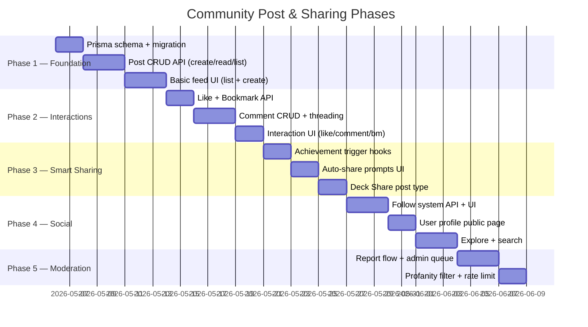

# 🌐 Community Post & Sharing — Feature Requirements

> Suggestions for building a social/community layer on top of the existing TOEIC/IELTS learning platform.

---

## 1. Why This Feature?

Your app already has strong **individual learning** modules (TOEIC exams, IELTS skills, Vocab Lab, Shadowing, Dictation, Pronunciation, Grammar). A **Community Post & Sharing** module creates a social loop that:

- 🔁 **Increases retention** — users come back to check responses
- 📈 **Drives content discovery** — tips, decks, and strategies spread organically
- 🏆 **Motivates learning** — sharing achievements creates positive reinforcement
- 🤝 **Enables peer learning** — students help each other, reducing instructor load

---

## 2. Domain-Specific Post Types

Instead of a generic "text post" feed, leverage what your app already tracks to create **rich, structured post types**:

| Post Type | Auto-Generated Data | User Input |
|:---|:---|:---|
| **🏅 Score Achievement** | Exam title, score, band, percentile | Caption, reflection |
| **📚 Deck Share** | Deck name, card count, card type, tags | Description, tips on how to study |
| **💡 Study Tip** | — | Title, rich-text body, related skill tag |
| **🎯 Daily Streak** | Current streak count, longest streak | Motivational message |
| **📝 Exam Discussion** | Exam title, Part number | Question, observations, strategy |
| **🔊 Shadowing Clip** | Video title, sentence, user recording | Notes on pronunciation |
| **📖 Grammar Q&A** | Grammar unit, book level | Question text, screenshot |
| **🗣️ Pronunciation Win** | Sound symbol, best score | Before/after recordings |

> [!TIP]
> Structured post types let you build **type-specific UI cards** with inline previews (e.g., a mini flashcard carousel inside a Deck Share post), making the feed visually rich.

---

## 3. Core Features

### 3.1. Post Creation

| Requirement | Details |
|:---|:---|
| **Rich Text Editor** | Markdown or lightweight WYSIWYG (bold, lists, code blocks, links) |
| **Media Attachments** | Up to 4 images, 1 audio clip (for pronunciation/shadowing posts) |
| **Tagging** | Select 1–3 skill tags: `Listening`, `Reading`, `Writing`, `Speaking`, `Vocabulary`, `Grammar`, `Pronunciation` |
| **Post Type Selection** | User picks a post type → form adapts to show relevant auto-filled data |
| **Visibility** | `Public` (all users) or `Teacher-Only` (visible to linked teachers) |
| **Draft Support** | Save drafts locally before publishing |

### 3.2. Feed & Discovery

| Requirement | Details |
|:---|:---|
| **Home Feed** | Chronological + relevance-weighted (posts from followed users first) |
| **Explore Tab** | Trending posts, filtered by skill tag or post type |
| **Search** | Full-text search on post title + body |
| **Infinite Scroll** | Cursor-based pagination (not offset) for performance |
| **Filter Chips** | Quick filters: `All`, `Tips`, `Achievements`, `Decks`, `Q&A` |

### 3.3. Social Interactions

| Feature | Description |
|:---|:---|
| **Like (❤️)** | Simple toggle, shows count |
| **Comment** | Threaded comments (1 level of reply) with markdown support |
| **Bookmark (🔖)** | Save posts to a personal collection for later |
| **Share Link** | Copy shareable URL to clipboard |
| **Report** | Flag inappropriate content (sends to admin queue) |

### 3.4. User Profile Integration

| Feature | Description |
|:---|:---|
| **Post History** | "My Posts" tab on profile page |
| **Public Profile** | Display: name, avatar, join date, streak, total posts, top skill tags |
| **Follow System** | Follow/unfollow other learners, followers/following counts |
| **Activity Feed** | Recent activity: posts, comments, likes, achievements |

---

## 4. Smart Sharing (Auto-Generated Posts)

Leverage existing app events to **prompt** users to share:

| Trigger Event | Suggested Post |
|:---|:---|
| User completes an exam with score ≥ 700 (TOEIC) or ≥ 6.5 (IELTS) | "🎉 Congratulations! Share your achievement?" |
| User hits a 7-day streak | "🔥 You're on a 7-day streak! Inspire others?" |
| User publishes a deck to community | Auto-create a Deck Share post |
| User masters a pronunciation sound (score ≥ 80) | "🗣️ You mastered /θ/! Share your tip?" |
| User completes all exercises in a Grammar unit | "📖 Grammar milestone! Share what you learned?" |

> [!NOTE]
> These should be **opt-in prompts** (modal or toast), never auto-posted without consent.

---

## 5. Content Moderation

| Level | Mechanism |
|:---|:---|
| **Automated** | Profanity filter on post body + comments (use a word list or AI) |
| **Community** | Report button → admin review queue |
| **Admin Dashboard** | New `/admin/community` page: reported posts, ban users, pin announcements |
| **Rate Limiting** | Max 10 posts/day, max 50 comments/day per user |

---

## 6. Gamification Integration

Connect posts to a simple **reputation/XP system**:

| Action | XP Earned |
|:---|:---|
| Create a post | +10 XP |
| Receive a like | +2 XP |
| Post gets bookmarked | +5 XP |
| Leave a helpful comment | +3 XP |
| Share a deck (community publish) | +20 XP |

| Badge | Condition |
|:---|:---|
| **First Post** | Create 1 post |
| **Helpful Helper** | Receive 50 likes on comments |
| **Deck Creator** | Share 5 decks to community |
| **Streak Master** | Share a 30-day streak achievement |
| **Top Contributor** | Reach 500 XP in community |

---

## 7. Suggested Prisma Schema

```prisma
// ============================================================
// COMMUNITY POSTS & SHARING
// ============================================================

enum PostType {
  STUDY_TIP
  SCORE_ACHIEVEMENT
  DECK_SHARE
  DAILY_STREAK
  EXAM_DISCUSSION
  SHADOWING_CLIP
  GRAMMAR_QA
  PRONUNCIATION_WIN
  GENERAL
}

enum PostVisibility {
  PUBLIC
  TEACHER_ONLY
}

model Post {
  id          String         @id @default(uuid())
  authorId    String
  type        PostType       @default(GENERAL)
  visibility  PostVisibility @default(PUBLIC)
  
  title       String?
  body        String         @db.Text    // Markdown content
  mediaUrls   String[]       @default([])
  tags        String[]       @default([]) // skill tags
  
  // Auto-attached context (depends on PostType)
  metadata    Json?          // e.g. { examId, score, deckId, streakCount, soundSymbol }
  
  likeCount     Int          @default(0)
  commentCount  Int          @default(0)
  bookmarkCount Int          @default(0)
  
  isPinned    Boolean        @default(false) // Admin can pin announcements
  isHidden    Boolean        @default(false) // Soft-delete / moderation
  
  createdAt   DateTime       @default(now())
  updatedAt   DateTime       @updatedAt
  
  author      User           @relation("UserPosts", fields: [authorId], references: [id], onDelete: Cascade)
  comments    Comment[]
  likes       PostLike[]
  bookmarks   PostBookmark[]
  reports     PostReport[]
  
  @@index([authorId])
  @@index([type])
  @@index([createdAt])
  @@index([likeCount])
  @@map("posts")
}

model Comment {
  id        String   @id @default(uuid())
  postId    String
  authorId  String
  parentId  String?  // null = top-level, non-null = reply
  body      String   @db.Text
  
  likeCount Int      @default(0)
  isHidden  Boolean  @default(false)
  
  createdAt DateTime @default(now())
  updatedAt DateTime @updatedAt
  
  post      Post     @relation(fields: [postId], references: [id], onDelete: Cascade)
  author    User     @relation("UserComments", fields: [authorId], references: [id], onDelete: Cascade)
  parent    Comment? @relation("CommentReplies", fields: [parentId], references: [id], onDelete: Cascade)
  replies   Comment[] @relation("CommentReplies")
  likes     CommentLike[]
  
  @@index([postId, createdAt])
  @@index([authorId])
  @@map("comments")
}

model PostLike {
  id        String   @id @default(uuid())
  postId    String
  userId    String
  createdAt DateTime @default(now())
  
  post Post @relation(fields: [postId], references: [id], onDelete: Cascade)
  user User @relation("UserPostLikes", fields: [userId], references: [id], onDelete: Cascade)
  
  @@unique([postId, userId])
  @@map("post_likes")
}

model CommentLike {
  id        String   @id @default(uuid())
  commentId String
  userId    String
  createdAt DateTime @default(now())
  
  comment Comment @relation(fields: [commentId], references: [id], onDelete: Cascade)
  user    User    @relation("UserCommentLikes", fields: [userId], references: [id], onDelete: Cascade)
  
  @@unique([commentId, userId])
  @@map("comment_likes")
}

model PostBookmark {
  id        String   @id @default(uuid())
  postId    String
  userId    String
  createdAt DateTime @default(now())
  
  post Post @relation(fields: [postId], references: [id], onDelete: Cascade)
  user User @relation("UserBookmarks", fields: [userId], references: [id], onDelete: Cascade)
  
  @@unique([postId, userId])
  @@map("post_bookmarks")
}

model PostReport {
  id        String   @id @default(uuid())
  postId    String
  userId    String
  reason    String
  status    String   @default("PENDING") // PENDING | REVIEWED | DISMISSED
  createdAt DateTime @default(now())
  
  post Post @relation(fields: [postId], references: [id], onDelete: Cascade)
  user User @relation("UserReports", fields: [userId], references: [id], onDelete: Cascade)
  
  @@map("post_reports")
}

model UserFollow {
  id          String   @id @default(uuid())
  followerId  String
  followingId String
  createdAt   DateTime @default(now())
  
  follower  User @relation("UserFollowers", fields: [followerId], references: [id], onDelete: Cascade)
  following User @relation("UserFollowing", fields: [followingId], references: [id], onDelete: Cascade)
  
  @@unique([followerId, followingId])
  @@map("user_follows")
}
```

> [!IMPORTANT]
> You'll need to add the reverse relations to the existing `User` model:
> ```prisma
> // Add to User model
> posts          Post[]         @relation("UserPosts")
> comments       Comment[]      @relation("UserComments")
> postLikes      PostLike[]     @relation("UserPostLikes")
> commentLikes   CommentLike[]  @relation("UserCommentLikes")
> bookmarks      PostBookmark[] @relation("UserBookmarks")
> reports        PostReport[]   @relation("UserReports")
> followers      UserFollow[]   @relation("UserFollowing") // people who follow me
> following      UserFollow[]   @relation("UserFollowers") // people I follow
> ```

---

## 8. Implementation Roadmap



### Phase Summary

| Phase | Scope | Backend Endpoints | Frontend Pages |
|:---|:---|:---|:---|
| **Phase 1** | Post CRUD + Feed | `POST /posts`, `GET /posts`, `GET /posts/:id`, `PATCH /posts/:id`, `DELETE /posts/:id` | `/community` feed page, create post modal |
| **Phase 2** | Likes, Comments, Bookmarks | `POST /posts/:id/like`, `DELETE /posts/:id/like`, `POST /posts/:id/comments`, `POST /posts/:id/bookmark` | Inline interaction buttons, comment section |
| **Phase 3** | Smart auto-share prompts | Hooks in exam/streak/deck services | Achievement prompt modal |
| **Phase 4** | Follow + Explore | `POST /users/:id/follow`, `GET /users/:id/profile`, `GET /posts/explore` | Profile page, explore tab |
| **Phase 5** | Moderation | `POST /posts/:id/report`, `GET /admin/reports`, `PATCH /admin/reports/:id` | Admin moderation dashboard |

---

## 9. Key UX Considerations

1. **Feed Performance** — Use cursor-based pagination (`createdAt` + `id` cursor) instead of offset for infinite scroll
2. **Optimistic Updates** — Like/bookmark actions should update UI instantly, then sync to server
3. **Notification Integration** — Connect to your existing `Notification` model: notify on likes, comments, follows
4. **Mobile-First** — Design card layout that works on your React Native app as well
5. **Empty States** — When feed is empty, show onboarding: "Share your first study tip!" with example cards

---

## 10. Questions to Decide Before Building

> [!WARNING]
> These are design decisions you should settle before starting implementation:

1. **Scope for thesis?** — Do you want all 5 phases, or just Phase 1-2 as an MVP?
2. **Follow system?** — Is follow/following necessary, or is a simple global feed enough?
3. **Gamification?** — Do you want the XP/badge system, or is it out of scope?
4. **Real-time?** — Should the feed update in real-time (WebSocket), or is polling/manual refresh sufficient?
5. **Media hosting?** — Are you using Cloudinary for post images too, or a different storage?
6. **Which post types first?** — Recommend starting with `STUDY_TIP` + `SCORE_ACHIEVEMENT` + `GENERAL` as MVP
