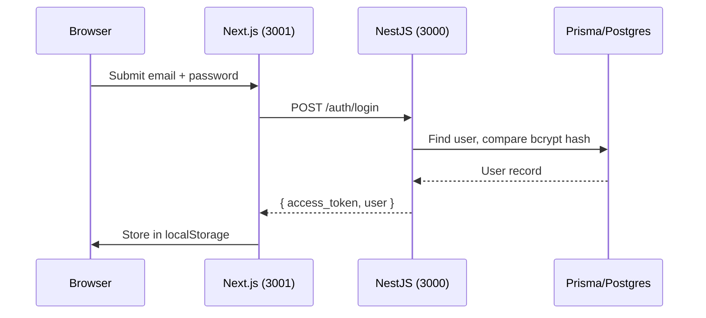
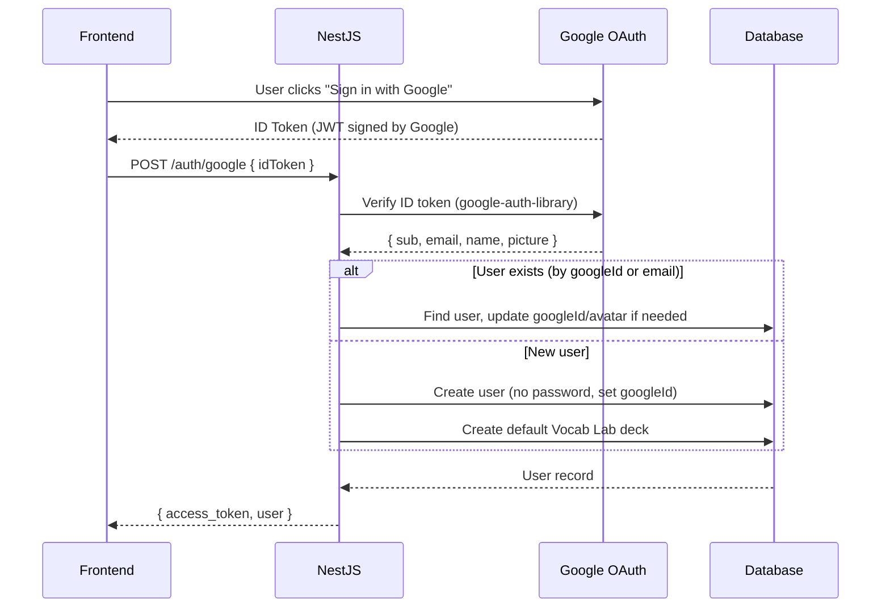

# Plan: Google OAuth Sign-In / Sign-Up

## Current Architecture



**Current state:**
- Email/password only — `password` field is **required** (`String`, not `String?`)
- NestJS uses **Passport** with `LocalStrategy` + `JwtStrategy`
- Frontend stores JWT + user in `localStorage`
- No Google/OAuth configuration exists

---

## Strategy Choice

There are two conventional approaches:

| | Strategy A: **Frontend-Initiated (GIS)** | Strategy B: **Server-Initiated (Passport)** |
|---|---|---|
| **Flow** | Google button on frontend → ID token → send to backend → verify & issue JWT | Backend redirects to Google → callback URL → issue JWT → redirect back |
| **Library (frontend)** | `@react-oauth/google` or raw Google Identity Services | None (just a link) |
| **Library (backend)** | `google-auth-library` (verify ID token) | `passport-google-oauth20` |
| **UX** | Seamless popup, no page redirect ✅ | Full-page redirect to Google and back |
| **Complexity** | Simpler — no callback routes, no sessions | More moving parts |
| **Used by** | YouTube, Gmail, modern SPAs | Traditional server-rendered apps |

> [!IMPORTANT]
> **Recommendation: Strategy A (Frontend-Initiated)**
> This is the modern convention for SPA/Next.js apps. The user clicks "Sign in with Google", a popup appears, Google returns an ID token, and the frontend sends it to your backend for verification. No page redirects, no callback URLs to manage.

---

## Prerequisites — Google Cloud Console

Before any code, you need to set up a Google OAuth client:

### Steps:
1. Go to [Google Cloud Console](https://console.cloud.google.com/)
2. Create a project (or select your existing one)
3. Navigate to **APIs & Services → Credentials**
4. Click **Create Credentials → OAuth client ID**
5. Application type: **Web application**
6. Configure:
   - **Authorized JavaScript origins**: `http://localhost:3001` (dev), your production domain
   - **Authorized redirect URIs**: `http://localhost:3001` (for GIS popup mode, no callback needed)
7. Copy the **Client ID** (you'll use this in both frontend and backend)
8. Copy the **Client Secret** (backend only, for extra verification if needed)

### Environment Variables

```env
# backend-core/.env
GOOGLE_CLIENT_ID=your-google-client-id.apps.googleusercontent.com
GOOGLE_CLIENT_SECRET=your-google-client-secret

# frontend-web/.env.local
NEXT_PUBLIC_GOOGLE_CLIENT_ID=your-google-client-id.apps.googleusercontent.com
```

---

## Phase 1 — Database Migration

### Schema Change

```diff
  model User {
    id        String   @id @default(uuid())
    email     String   @unique
-   password  String
+   password  String?              // Nullable for OAuth-only users
+   googleId  String?  @unique     // Google sub (unique user ID)
+   avatar    String?              // Google profile picture URL
    firstName String?
    lastName  String?
    role      UserRole @default(STUDENT)
    isActive  Boolean  @default(true)
    createdAt DateTime @default(now())
    updatedAt DateTime @updatedAt
    ...
  }
```

> [!WARNING]
> Making `password` nullable is critical. Google OAuth users don't have passwords. Your `changePassword` endpoint and login validation must handle `password === null` gracefully.

### Migration Command
```bash
npx prisma migrate dev --name add-google-oauth
```

---

## Phase 2 — Backend: Google Auth Endpoint

### Install
```bash
cd backend-core
npm install google-auth-library
```

### New Endpoint: `POST /auth/google`

```
POST /auth/google
Body: { idToken: "eyJhbG..." }
Response: { access_token: "jwt...", user: {...} }
```

### Flow



### Files to change/create

| File | Action |
|------|--------|
| `auth.service.ts` | Add `googleLogin(idToken)` method |
| `auth.controller.ts` | Add `POST /auth/google` endpoint |
| `auth.module.ts` | Add `ConfigService` injection for Google Client ID |

### `googleLogin()` Logic (pseudocode)

```typescript
async googleLogin(idToken: string) {
  // 1. Verify the token with Google
  const ticket = await googleClient.verifyIdToken({
    idToken,
    audience: GOOGLE_CLIENT_ID,
  });
  const { sub: googleId, email, given_name, family_name, picture } = ticket.getPayload();

  // 2. Find or create user
  let user = await prisma.user.findFirst({
    where: { OR: [{ googleId }, { email }] },
  });

  if (user) {
    // Link Google ID if user exists by email but hasn't linked Google yet
    if (!user.googleId) {
      user = await prisma.user.update({
        where: { id: user.id },
        data: { googleId, avatar: picture },
      });
    }
  } else {
    // Create new user (no password)
    user = await prisma.user.create({
      data: {
        email,
        googleId,
        firstName: given_name,
        lastName: family_name,
        avatar: picture,
        role: 'STUDENT',
      },
    });
    // Create default deck
    await prisma.deck.create({ data: { userId: user.id, name: 'Default' } });
  }

  // 3. Issue JWT (same as regular login)
  const payload = { email: user.email, sub: user.id, role: user.role };
  return {
    access_token: this.jwtService.sign(payload),
    user: { id: user.id, email: user.email, firstName: user.firstName, ... },
  };
}
```

### Guard `changePassword` for OAuth users

```typescript
// auth.service.ts — changePassword()
if (!user.password) {
  throw new BadRequestException(
    "Cannot change password for Google sign-in accounts. Your account uses Google authentication."
  );
}
```

---

## Phase 3 — Frontend

### Install

```bash
cd frontend-web
npm install @react-oauth/google
```

### Setup: `GoogleOAuthProvider` in `layout.tsx`

Wrap the app in Google's provider:

```tsx
import { GoogleOAuthProvider } from '@react-oauth/google';

// Inside RootLayout:
<GoogleOAuthProvider clientId={process.env.NEXT_PUBLIC_GOOGLE_CLIENT_ID!}>
  <AuthProvider>
    ...
  </AuthProvider>
</GoogleOAuthProvider>
```

### AuthContext: Add `loginWithGoogle()`

```typescript
// AuthContext.tsx
const loginWithGoogle = async (idToken: string) => {
  const { data } = await api.post<AuthResponse>('/auth/google', { idToken });
  if (data.access_token) {
    localStorage.setItem(STORAGE_KEYS.ACCESS_TOKEN, data.access_token);
    if (data.user) {
      localStorage.setItem('user', JSON.stringify(data.user));
      setUser(data.user);
    }
  }
};
```

### Google Button Component

Create a reusable component:

```tsx
// components/GoogleSignInButton.tsx
import { useGoogleLogin } from '@react-oauth/google';

export function GoogleSignInButton({ onSuccess }) {
  const login = useGoogleLogin({
    onSuccess: (response) => onSuccess(response.credential),
    flow: 'implicit',  // or 'auth-code'
  });

  return (
    <button onClick={() => login()} className="...">
      <GoogleIcon />
      Continue with Google
    </button>
  );
}
```

### Login & Register Pages

Add below the existing form on both pages:

```
┌─────────────────────────────────────┐
│         [  Sign In  ]               │  ← existing email/password
├─────────────────────────────────────┤
│         ── or ──                    │  ← divider
├─────────────────────────────────────┤
│    [G  Continue with Google  ]      │  ← new Google button
└─────────────────────────────────────┘
```

---

## Phase 4 — Profile & Edge Cases

### Profile Page Updates

| Scenario | What to show |
|----------|-------------|
| **Password user** | Show all sections (personal info, change password, delete account) |
| **Google user** | Show personal info + delete account. **Hide** change password. Show "Signed in with Google" badge |
| **Linked user** (had password, later linked Google) | Show everything. Show "Google account linked" badge |

### User Type Detection

```typescript
// The user object should include a flag
interface User {
  ...
  googleId?: string;  // if present → Google user
  avatar?: string;    // Google profile picture
}
```

### Avatar Display

Currently the app uses initials. With Google OAuth, users have a real avatar:

```tsx
// ProfileHeader.tsx, Navbar.tsx
{user.avatar ? (
  
) : (
  <span className="...">{initials}</span>
)}
```

---

## File Change Summary

### Database (1 file)
| File | Change |
|------|--------|
| `prisma/schema.prisma` | Make `password` nullable, add `googleId` + `avatar` fields |

### Backend (3–4 files)
| File | Change |
|------|--------|
| `auth.service.ts` | Add `googleLogin()`, guard `changePassword()` for OAuth users |
| `auth.controller.ts` | Add `POST /auth/google` endpoint |
| `auth.module.ts` | Import `ConfigModule` for Google Client ID access |
| `users.service.ts` | Include `avatar` and `googleId` in `select` queries |

### Frontend (6–7 files)
| File | Change |
|------|--------|
| `.env.local` | Add `NEXT_PUBLIC_GOOGLE_CLIENT_ID` |
| `app/layout.tsx` | Wrap with `GoogleOAuthProvider` |
| `contexts/AuthContext.tsx` | Add `loginWithGoogle()` |
| `types/index.ts` | Add `googleId?`, `avatar?` to `User` type |
| `app/login/page.tsx` | Add Google sign-in button + divider |
| `app/register/page.tsx` | Add Google sign-up button + divider |
| `app/profile/ProfileContent.tsx` | Conditionally hide password section for Google users |
| `components/Navbar.tsx` | Show avatar image for Google users |

---

## Estimated Effort

| Phase | What | Time |
|-------|------|------|
| Prerequisites | Google Cloud Console setup | ~15 min |
| Phase 1 | DB migration (password nullable, new fields) | ~10 min |
| Phase 2 | Backend `POST /auth/google` endpoint | ~30 min |
| Phase 3 | Frontend Google button + AuthContext | ~30 min |
| Phase 4 | Profile + avatar + edge cases | ~20 min |
| **Total** | | **~1.5–2 hours** |

---

## Security Considerations

> [!CAUTION]
> - **Always verify the ID token server-side** using `google-auth-library`. Never trust a token from the client without verification.
> - **Check the `aud` (audience) claim** matches your Client ID — prevents token substitution attacks.
> - **Don't store the Google Client Secret in the frontend** — it belongs in `.env` on the backend only.
> - **Account linking**: When a user with an existing email signs in with Google, link the accounts (don't create a duplicate). The pseudocode above handles this.
