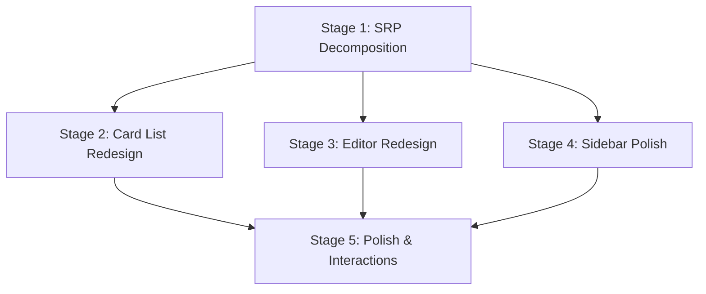

# Vocab Lab Browse Tab — Redesign Plan

> **Goal:** Decompose the monolithic 822-line `BrowseTab.tsx` into well-separated sub-components following SRP, and redesign the UI for a more polished, Anki-inspired card browsing experience.

---

## Current State Analysis

### Architecture Problem
`BrowseTab.tsx` is a **single 822-line file** containing:
- Filter sidebar (Decks, Card State, Card Types, Tags) — ~170 lines of JSX
- Card list table — ~100 lines of JSX
- Card editor panel with formatting toolbar — ~220 lines of JSX
- Business logic (fetching, saving, deleting, media upload, tag management, style toggling) — ~300 lines
- Helper components defined inline (`ToolbarButton`, `ToolbarDivider`) — ~15 lines

This violates SRP. The component simultaneously handles data fetching, filtering, rendering a table, editing cards, uploading media, and managing formatting styles.

### Visual Problems
1. **Three-panel layout is cramped** — filter sidebar + card list + editor all squeezed at a fixed 650px height
2. **No search** — users can only filter by sidebar categories, no text search
3. **Card list is a flat table** — no card preview, no visual card state indicators beyond a tiny dot
4. **Editor formatting toolbar is heavy** — takes up too much visual space relative to its utility
5. **No keyboard navigation** — can't use ↑/↓ arrows to move between cards
6. **No batch operations** — can't select multiple cards to delete/move

### Key Files
| File | Lines | Purpose |
|------|-------|---------|
| `frontend-web/src/app/vocab-lab/components/BrowseTab.tsx` | 822 | Everything |
| `frontend-web/src/services/vocabLab.api.ts` | 154 | API client (already has `browseCards`, `updateFlashcard`, `deleteFlashcard`) |
| `frontend-web/src/types/index.ts` | ~510 | `Flashcard`, `DeckWithCounts`, `CardType` types |

---

## Implementation Stages

### Stage 1: Component Decomposition (SRP Refactor)

**Objective:** Break the monolith into 5 focused components + 1 custom hook, without changing any visual design yet.

#### 1.1 — Extract custom hook: `useBrowseCards.ts`

**File:** `frontend-web/src/app/vocab-lab/components/browse/useBrowseCards.ts`

Move ALL business logic into this hook:
```typescript
export function useBrowseCards(isActive: boolean) {
  // State: cards, decks, tags, cardTypes, filter, selectedCard, loading
  // State: editFieldValues, editFieldStyles, editTagsList, tagInput
  // State: saving, message, showDeleteConfirm
  // 
  // Methods: fetchCards, fetchInitialData, handleSelectCard
  // Methods: handleSaveCard, handleDeleteCard, confirmDeleteCard
  // Methods: handleAddTag, handleRemoveTag
  // Methods: handleUploadClick, handleFileUpload
  // Methods: toggleStyle, setStyle, isActiveStyle
  // Helpers: getSortFieldValue, fieldStyleToCSS, pick (filter setter)
  //
  // Returns all state + methods needed by the UI components
}
```

**Rules:**
- This hook contains ZERO JSX
- All `useState`, `useEffect`, `useRef` for business logic live here
- The hook returns a typed object containing all values and callbacks

#### 1.2 — Extract filter sidebar: `BrowseFilterSidebar.tsx`

**File:** `frontend-web/src/app/vocab-lab/components/browse/BrowseFilterSidebar.tsx`

Props (ISP — only what it needs):
```typescript
interface BrowseFilterSidebarProps {
  decks: DeckWithCounts[];
  cardTypes: CardType[];
  tags: string[];
  filter: { type: string; value: string } | null;
  onFilterChange: (type: string, value: string) => void;
}
```

Contains: The four collapsible sections (Decks, Card State, Card Types, Tags) with their collapse state managed locally within this component.

#### 1.3 — Extract card list: `BrowseCardList.tsx`

**File:** `frontend-web/src/app/vocab-lab/components/browse/BrowseCardList.tsx`

Props:
```typescript
interface BrowseCardListProps {
  cards: Flashcard[];
  selectedCardId: string | null;
  loading: boolean;
  onSelectCard: (card: Flashcard) => void;
  getSortFieldValue: (card: Flashcard) => string;
}
```

Contains: The table with header, rows, loading spinner, and empty state.

#### 1.4 — Extract card editor: `BrowseCardEditor.tsx`

**File:** `frontend-web/src/app/vocab-lab/components/browse/BrowseCardEditor.tsx`

Props:
```typescript
interface BrowseCardEditorProps {
  card: Flashcard;
  editFieldValues: Record<string, string>;
  editFieldStyles: Record<string, any>;
  editTagsList: string[];
  tagInput: string;
  saving: boolean;
  message: { type: 'success' | 'error'; text: string } | null;
  onFieldValueChange: (fieldId: string, value: string) => void;
  onFieldStyleChange: (fieldId: string, styles: any) => void;
  onTagInputChange: (value: string) => void;
  onAddTag: (e: KeyboardEvent) => void;
  onRemoveTag: (tag: string) => void;
  onSave: () => void;
  onDelete: () => void;
  onUpload: (type: 'image' | 'audio') => void;
  onFileUpload: (e: ChangeEvent, type: 'image' | 'audio') => void;
}
```

Contains: Card type label, formatting toolbar, dynamic fields, tags editor, action buttons, review info footer.

#### 1.5 — Extract formatting toolbar: `EditorToolbar.tsx`

**File:** `frontend-web/src/app/vocab-lab/components/browse/EditorToolbar.tsx`

Props:
```typescript
interface EditorToolbarProps {
  activeFieldId: string | null;
  fieldStyles: Record<string, any>;
  isUploading: boolean;
  onToggleStyle: (key: string, val: string) => void;
  onSetStyle: (key: string, val: string) => void;
  onUploadClick: (type: 'image' | 'audio') => void;
}
```

Contains: Bold, Italic, Underline, Color, Align, Insert Image, Attach File buttons.

#### 1.6 — Slim down `BrowseTab.tsx` to a coordinator

**File:** `frontend-web/src/app/vocab-lab/components/BrowseTab.tsx`

After extraction, this file should be ~40-60 lines:
```tsx
export function BrowseTab({ isActive }: { isActive: boolean }) {
  const browse = useBrowseCards(isActive);
  return (
    <div className="flex ...">
      <BrowseFilterSidebar ... />
      <BrowseCardList ... />
      <BrowseCardEditor ... />
      <ConfirmModal ... />
    </div>
  );
}
```

---

### Stage 2: UI Redesign — Card List

**Objective:** Transform the flat table into a more visual, scannable card list.

#### 2.1 — Add search bar

Add a search input above the card list that filters cards client-side by matching against field values and tags. This is the single most impactful UX improvement for users with many cards.

```
┌─────────────────────────────────────┐
│ 🔍 Search cards...          23 cards│
├─────────────────────────────────────┤
│ ● cruel          essential   New    │
│ ● afraid         essential   New    │
│   promise        essential   3d     │
│ ● hunt           essential   New    │
│   ...                               │
└─────────────────────────────────────┘
```

#### 2.2 — Redesign card rows

Replace the multi-column table with cleaner, denser card rows:
- **Left**: State dot (color) + primary field value (truncated)
- **Center**: Card type badge (small, muted)
- **Right**: Due date or "New" badge
- Active row: left yellow accent bar (keep existing), subtle yellow background
- Add keyboard navigation (↑/↓ arrows move selection)

#### 2.3 — Add sort controls

A small dropdown or toggle in the card list header:
- Sort by: Created date (default), Due date, Alphabetical, Card state
- Sort direction toggle (ascending/descending)

---

### Stage 3: UI Redesign — Card Editor

**Objective:** Make the editor panel cleaner, with better visual hierarchy.

#### 3.1 — Collapsible formatting toolbar

The toolbar should be hidden by default with a small "Format" toggle button. Most users editing Anki-style cards don't need formatting on every edit. This saves ~40px of vertical space.

#### 3.2 — Improved field layout

- Show a live preview of how the card will look when studied (rendered HTML) below the editing fields
- Add a toggle: "Edit" vs "Preview" mode for each field
- Fields with media should show the media inline with a cleaner overlay for remove

#### 3.3 — Card metadata panel

The review stats at the bottom (State, Stability, Difficulty, Interval, Reps) should be in a collapsible "Card Info" section with proper labels and subtle visual treatment:

```
┌ Card Info ────────────────────┐
│ State       NEW               │
│ Due         Not yet reviewed  │
│ Interval    0 days            │
│ Reps        0                 │
│ Lapses      0                 │
│ Stability   0.00              │
│ Difficulty  0.00              │
│ Created     Apr 27, 2026      │
└───────────────────────────────┘
```

---

### Stage 4: UI Redesign — Filter Sidebar

**Objective:** Polish the filter sidebar with counts and better visual feedback.

#### 4.1 — Show counts next to each filter item

Each deck, card type, and tag should display the number of cards that match:
```
Decks
  📁 4000 Essential Words B1    (12)
  📁 IELTS Vocabulary           (8)
  
Card State
  ● New                         (16)
  ● Learning                    (4)  
  ● Review                      (1)
```

This requires a minor backend change: `browseCards` should return total counts per filter, OR compute counts client-side from the full card set.

#### 4.2 — Quick clear filters

Add a small "Clear" button that appears when any filter is active, allowing one-click reset.

#### 4.3 — Responsive collapse

On mobile (< md breakpoint), the filter sidebar should collapse into a dropdown/sheet instead of being always visible.

---

### Stage 5: Polish & Interactions

**Objective:** Add keyboard navigation, batch operations, and animation polish.

#### 5.1 — Keyboard navigation
- `↑`/`↓` arrows in the card list to move between cards
- `Enter` to focus the editor
- `Ctrl+S` to save the current card
- `Delete` key to trigger delete confirmation

#### 5.2 — Batch operations
- Add a checkbox column to the card list
- When ≥1 card is checked, show a batch action bar: "Delete selected", "Move to deck"
- This requires a new API endpoint or looping calls

#### 5.3 — Animations
- Fade-in transition when switching selected cards
- Smooth height transitions when fields expand/collapse
- Subtle slide-in for the editor panel content

---

## File Structure After Redesign

```
frontend-web/src/app/vocab-lab/components/
├── BrowseTab.tsx                     — Coordinator (~50 lines)
├── browse/
│   ├── useBrowseCards.ts             — Custom hook (all business logic)
│   ├── BrowseFilterSidebar.tsx       — Left sidebar with filters
│   ├── BrowseCardList.tsx            — Center panel with search + card rows
│   ├── BrowseCardEditor.tsx          — Right panel with field editor
│   └── EditorToolbar.tsx             — Formatting toolbar sub-component
```

---

## Implementation Order & Dependencies



> [!IMPORTANT]
> **Stage 1 must be completed first** — it is a pure refactor (no visual changes) that creates the component boundaries. Stages 2-4 can be done in parallel after Stage 1. Stage 5 depends on all three.

**Estimated effort:**
| Stage | Scope | Risk |
|-------|-------|------|
| 1 | Mechanical refactor — move code, no logic changes | Low |
| 2 | New search, redesigned rows, sort | Medium |
| 3 | Toolbar collapse, preview mode | Medium |
| 4 | Count badges, clear button, responsive | Low |
| 5 | Keyboard nav, batch ops, animations | Medium |

---

## Design Guidelines

### Color Palette (matches Lexon design system)
| Element | Color | Usage |
|---------|-------|-------|
| Selected row accent | `#FFC600` / `bg-amber-50` | Active card highlight |
| Filter active | `#FEF3C7` (amber-50) | Selected filter background |
| New state | `#3B82F6` (blue-500) | New card dot |
| Learning state | `#EF4444` (red-500) | Learning card dot |
| Review state | `#10B981` (green-500) | Review card dot |
| Destructive | `red-50` / `red-600` | Delete buttons |
| Primary CTA | `#FFC600` | Save button |

### Typography
- Card list: `text-sm` (14px) for primary field, `text-xs` (12px) for metadata
- Editor fields: `text-[15px]` for input, `text-[11px]` uppercase for labels
- Section headers: `text-xs` uppercase `tracking-wider` `font-bold`

### Spacing
- Sidebar padding: `p-5` (20px)
- Card list row: `px-4 py-3` 
- Editor fields: `p-3.5` inside bordered containers
- Section gaps: `space-y-4` within panels, `gap-4` between panels
