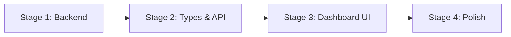

# Vocab Lab — Enhanced Statistics Plan

> **Goal:** Transform the barebones Stats page (currently just a pie chart of card states) into a comprehensive analytics dashboard inspired by Anki's statistics, providing real study insights.

---

## Current State

### What Exists Today
- **Backend**: `GET /vocab-lab/stats` returns `{ newCount, learningCount, reviewCount, totalCount }`
- **Frontend**: `StatsTab.tsx` renders a single conic-gradient pie chart + legend
- **Data available but unused**: The `FlashcardReview` table already stores every review with `rating`, `reviewedAt`, `scheduledDays`, `elapsedDays`, `state` — this is a goldmine for analytics

### Key Files
| Layer | File | Purpose |
|-------|------|---------|
| **Prisma Schema** | `backend-core/prisma/schema.prisma` (L541–L585) | `Flashcard` and `FlashcardReview` models |
| **Backend Service** | `backend-core/src/modules/vocab-lab/vocab-lab.service.ts` (L759–L771) | `getStats()` — currently only counts card states |
| **Backend Controller** | `backend-core/src/modules/vocab-lab/vocab-lab.controller.ts` (L203–L205) | `GET stats` route |
| **Frontend API** | `frontend-web/src/services/vocabLab.api.ts` (L83–L86) | `getStats()` client call |
| **Frontend Types** | `frontend-web/src/types/index.ts` (L411–L416) | `VocabLabStats` interface |
| **Frontend UI** | `frontend-web/src/app/vocab-lab/components/StatsTab.tsx` | The stats page component |

---

## Implementation Stages

### Stage 1: Expand Backend Stats Endpoint

**Objective:** Enrich `GET /vocab-lab/stats` to return all the data the frontend will need.

**File:** `backend-core/src/modules/vocab-lab/vocab-lab.service.ts`

#### 1.1 — Expand `getStats()` return shape

Replace the simple card-state count with a rich response object:

```typescript
// New return shape from getStats()
interface EnhancedVocabLabStats {
  // Existing — Card State Distribution (pie chart)
  cardCounts: {
    newCount: number;
    learningCount: number;
    reviewCount: number;
    relearningCount: number;  // NEW — currently missing
    totalCount: number;
  };

  // NEW — Review Activity (bar chart: reviews per day)
  reviewActivity: {
    date: string;      // ISO date string "2026-04-29"
    reviewCount: number;
    againCount: number;  // rating=1
    hardCount: number;   // rating=2
    goodCount: number;   // rating=3
    easyCount: number;   // rating=4
  }[];  // Last 30 days

  // NEW — Streak & Consistency
  streakData: {
    currentStreak: number;    // consecutive days with ≥1 review
    longestStreak: number;    // all-time longest streak
    totalReviewDays: number;  // total days where user reviewed
    totalReviews: number;     // all-time review count
  };

  // NEW — Card Maturity Distribution (how well-learned are cards)
  maturityDistribution: {
    young: number;      // interval < 21 days
    mature: number;     // interval ≥ 21 days
    suspended: number;  // cards with excessive lapses (lapses > 8)
  };

  // NEW — Forecast (cards due in next 30 days)
  forecast: {
    date: string;        // ISO date string
    dueCount: number;    // cards due on that date
    cumulativeCount: number; // running total
  }[];  // Next 30 days

  // NEW — Average Stats
  averages: {
    averageEasePercent: number;    // avg answer quality (rating) as %
    averageLapses: number;         // avg lapses per card
    averageInterval: number;       // avg scheduled interval (days) for REVIEW cards
    retentionRatePercent: number;  // % of reviews rated Good or Easy (rating ≥ 3)
  };

  // NEW — Hourly review distribution
  hourlyActivity: {
    hour: number;     // 0-23
    count: number;    // reviews in that hour slot
  }[];
}
```

#### 1.2 — Implementation approach

Query the `FlashcardReview` table grouped by date and rating. Key queries:

```typescript
// Review activity for last 30 days
const thirtyDaysAgo = new Date();
thirtyDaysAgo.setDate(thirtyDaysAgo.getDate() - 30);

const reviews = await this.prisma.flashcardReview.findMany({
  where: {
    flashcard: { deck: { userId } },
    reviewedAt: { gte: thirtyDaysAgo },
  },
  select: { reviewedAt: true, rating: true },
});

// Group by date, then count by rating
// For streaks: get all distinct review dates, find consecutive runs

// Maturity: query flashcards with their scheduledDays
const cards = await this.prisma.flashcard.findMany({
  where: { deck: { userId } },
  select: { cardState: true, scheduledDays: true, lapses: true, difficulty: true, due: true },
});

// Forecast: bucket cards by their `due` date for next 30 days
```

#### 1.3 — Add query parameter for time range

Add an optional `?range=30` query parameter to control the review activity window (default 30, options: 7, 30, 90, 365).

**Files to modify:**
- `backend-core/src/modules/vocab-lab/vocab-lab.service.ts` — expand `getStats()`
- `backend-core/src/modules/vocab-lab/vocab-lab.controller.ts` — add `@Query('range')` param

---

### Stage 2: Update Frontend Types & API Client

**Objective:** Update the TypeScript interfaces and API client to match the new backend response.

**Files to modify:**

#### 2.1 — `frontend-web/src/types/index.ts`

Replace the existing `VocabLabStats` interface (L411–L416) with the expanded version matching the backend response shape defined in Stage 1.

#### 2.2 — `frontend-web/src/services/vocabLab.api.ts`

Update `getStats()` to accept an optional `range` parameter:

```typescript
getStats: async (range?: number) => {
  const { data } = await api.get<VocabLabStats>('/vocab-lab/stats', {
    params: range ? { range } : undefined,
  });
  return data;
},
```

---

### Stage 3: Build the Stats Dashboard UI

**Objective:** Replace the single pie chart with a multi-section analytics dashboard.

**File:** `frontend-web/src/app/vocab-lab/components/StatsTab.tsx`

#### 3.1 — Dashboard Layout

Design as a vertical scrollable dashboard with these sections (in order):

```
┌───────────────────────────────────────────────────────────┐
│  ① Summary Cards (4 KPI cards in a row)                   │
│  [Total Cards] [Reviews Today] [Current Streak] [Retention]│
├───────────────────────────────────────────────────────────┤
│  ② Review Activity (stacked bar chart — last 30 days)      │
│  X-axis: dates, Y-axis: review count                      │
│  Bars colored by rating (Again/Hard/Good/Easy)            │
├──────────────────────┬────────────────────────────────────┤
│  ③ Card Counts       │  ④ Card Maturity                  │
│  (existing pie chart)│  (donut: Young/Mature/Suspended)  │
├──────────────────────┴────────────────────────────────────┤
│  ⑤ Future Due Forecast (area chart — next 30 days)        │
├───────────────────────────────────────────────────────────┤
│  ⑥ Hourly Activity (bar chart — 24 hours)                 │
└───────────────────────────────────────────────────────────┘
```

#### 3.2 — Chart Implementation

Use pure CSS/SVG for charts (no external chart libraries needed):

- **Pie/Donut Charts**: Continue using `conic-gradient` (already used)
- **Bar Charts**: Simple `div` bars with percentage-based heights inside a flex container
- **Area Charts**: SVG `<polygon>` or `<path>` elements
- **KPI Cards**: Styled divs with icons, numbers, and subtle backgrounds

> **IMPORTANT:** Do NOT install any chart library (like Chart.js, Recharts, etc.). Build all visualizations with pure CSS + inline SVG to keep the bundle lean.

#### 3.3 — Time Range Selector

Add a pill-based range selector at the top of the page:
- `[7 days]` `[30 days]` `[90 days]` `[1 year]`
- Default: 30 days
- Changing the range re-fetches stats with the new `range` param

#### 3.4 — Component Breakdown (SRP)

Extract each chart section into its own component to keep `StatsTab.tsx` manageable:

```
frontend-web/src/app/vocab-lab/components/stats/
├── SummaryCards.tsx          — 4 KPI cards
├── ReviewActivityChart.tsx   — Stacked bar chart
├── CardCountsPie.tsx         — Existing pie chart (refactored out)
├── MaturityDonut.tsx         — Maturity distribution donut
├── ForecastChart.tsx         — Future due area chart
└── HourlyActivityChart.tsx   — 24-hour bar chart
```

---

### Stage 4: Polish & Edge Cases

**Objective:** Handle empty states, loading, and visual refinements.

#### 4.1 — Empty States
- Show a friendly illustration/message when no reviews exist yet
- Disable time range selectors when there's no data

#### 4.2 — Loading States
- Show skeleton loaders for each chart section independently
- Use a staggered animation for visual polish

#### 4.3 — Responsiveness
- KPI cards: 4 columns on desktop → 2 columns on tablet → 1 column on mobile
- Charts: Full width with proper padding on all breakpoints
- Pie/donut charts: Scale down gracefully

#### 4.4 — Color Palette
Use the existing Lexon design system colors:
| Element | Color |
|---------|-------|
| Primary/Accent | `#FFC600` (brand yellow) |
| New cards | `#3B82F6` (blue) |
| Learning cards | `#EF4444` (red) |
| Review/Mature | `#10B981` (green) |
| Again rating | `#EF4444` |
| Hard rating | `#F59E0B` |
| Good rating | `#10B981` |
| Easy rating | `#3B82F6` |

---

## Implementation Order & Dependencies



**Estimated effort per stage:**
| Stage | Scope | Files Changed |
|-------|-------|---------------|
| 1 | Backend only | 2 files (service + controller) |
| 2 | Types only | 2 files (types + api client) |
| 3 | Frontend UI | 7 files (StatsTab + 6 chart components) |
| 4 | Polish | Same files as Stage 3 |

---

## Notes for Implementer

1. **FSRS Data**: The `FlashcardReview` table is the key data source. Each review has `rating` (1-4), `reviewedAt`, `scheduledDays`, `elapsedDays`, and `state`. This is everything needed for time-series analytics.

2. **No New Database Migrations**: All required data already exists in the schema. No Prisma schema changes are needed.

3. **Performance**: The `getStats()` query could get slow for users with many reviews. Consider:
   - Adding a `createdAt` index on `flashcard_reviews` if not present
   - Using Prisma's `groupBy` for date aggregation instead of fetching all rows
   - Capping the `range` parameter to a maximum of 365 days

4. **Backward Compatibility**: The backend should still return the old flat fields (`newCount`, `learningCount`, etc.) alongside the new nested structure, OR the frontend must be updated atomically with the backend change. Recommended: **atomic deploy** (update both at once).
