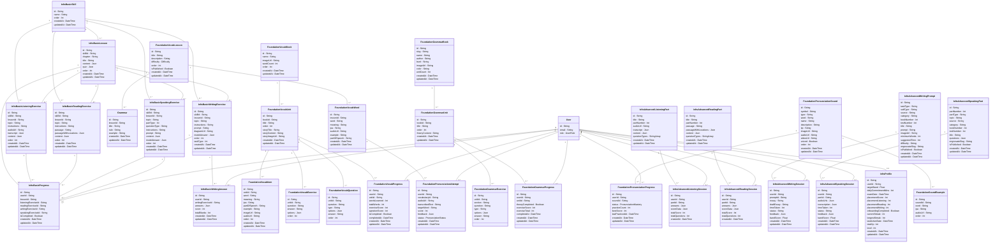

# Class Diagram — IELTS & Foundation Module

```mermaid
classDiagram
    class User {
        id : String
        email : String
        role : UserRole
    }

    class IeltsProfile {
        id : String
        userId : String
        targetBand : Float
        dailyCommitmentMins : Int
        examDate : DateTime
        placementScore : Int
        placementListening : Int
        placementReading : Int
        placementWriting : Int
        onboardingCompleted : Boolean
        currentStreak : Int
        longestStreak : Int
        lastActiveDate : DateTime
        totalXp : Int
        level : Int
        createdAt : DateTime
        updatedAt : DateTime
    }

    class FoundationVocabBook {
        id : String
        name : String
        imageUrl : String
        wordCount : Int
        order : Int
        createdAt : DateTime
        updatedAt : DateTime
    }

    class FoundationVocabUnit {
        id : String
        bookId : String
        title : String
        order : Int
        storyTitle : String
        storyContent : String
        storyImageUrl : String
        createdAt : DateTime
        updatedAt : DateTime
    }

    class FoundationVocabItem {
        id : String
        unitId : String
        word : String
        meaning : String
        ipa : String
        partOfSpeech : String
        example : String
        imageUrl : String
        audioUrl : String
        order : Int
        createdAt : DateTime
        updatedAt : DateTime
    }

    class FoundationVocabExercise {
        id : String
        unitId : String
        question : String
        answer : String
        options : Json
        order : Int
    }

    class FoundationVocabQuestion {
        id : String
        unitId : String
        question : String
        type : String
        options : Json
        answer : String
        order : Int
    }

    class FoundationVocabProgress {
        id : String
        userId : String
        unitId : String
        wordsLearned : Int
        totalWords : Int
        exerciseScore : Int
        questionScore : Int
        isCompleted : Boolean
        completedAt : DateTime
        createdAt : DateTime
        updatedAt : DateTime
    }

    class FoundationVocabLesson {
        id : String
        title : String
        description : String
        difficulty : Difficulty
        order : Int
        isPublished : Boolean
        createdAt : DateTime
        updatedAt : DateTime
    }

    class FoundationVocabWord {
        id : String
        lessonId : String
        word : String
        meaning : String
        ipa : String
        audioUrl : String
        example : String
        partOfSpeech : String
        createdAt : DateTime
        updatedAt : DateTime
    }

    class Grammar {
        id : String
        lessonId : String
        title : String
        rule : String
        example : String
        createdAt : DateTime
        updatedAt : DateTime
    }

    class FoundationGrammarBook {
        id : String
        slug : String
        name : String
        author : String
        level : String
        imageUrl : String
        color : String
        unitCount : Int
        createdAt : DateTime
        updatedAt : DateTime
    }

    class FoundationGrammarUnit {
        id : String
        bookId : String
        title : String
        order : Int
        theoryContent : String
        createdAt : DateTime
        updatedAt : DateTime
    }

    class FoundationGrammarExercise {
        id : String
        unitId : String
        section : String
        question : String
        type : String
        options : Json
        answer : String
        order : Int
    }

    class FoundationGrammarProgress {
        id : String
        userId : String
        unitId : String
        theoryCompleted : Boolean
        exerciseScore : Int
        exerciseTotal : Int
        completedAt : DateTime
        createdAt : DateTime
        updatedAt : DateTime
    }

    class FoundationPronunciationSound {
        id : String
        symbol : String
        type : String
        word : String
        name : String
        description : String
        tip : String
        imageUrl : String
        audioUrl : String
        videoUrl : String
        voiced : Boolean
        order : Int
        createdAt : DateTime
        updatedAt : DateTime
    }

    class FoundationSoundExample {
        id : String
        soundId : String
        word : String
        ipa : String
        audioUrl : String
        order : Int
    }

    class FoundationPronunciationProgress {
        id : String
        userId : String
        soundId : String
        status : PronunciationMastery
        practiceCount : Int
        bestScore : Int
        lastPracticedAt : DateTime
        createdAt : DateTime
        updatedAt : DateTime
    }

    class FoundationPronunciationAttempt {
        id : String
        userId : String
        vocabularyId : String
        audioUrl : String
        transcribedText : String
        targetWord : String
        score : Int
        feedback : Json
        status : PronunciationStatus
        createdAt : DateTime
        updatedAt : DateTime
    }

    class IeltsBasicSkill {
        id : String
        name : String
        order : Int
        createdAt : DateTime
        updatedAt : DateTime
    }

    class IeltsBasicLesson {
        id : String
        skillId : String
        chapter : String
        title : String
        content : Json
        quiz : Json
        order : Int
        createdAt : DateTime
        updatedAt : DateTime
    }

    class IeltsBasicListeningExercise {
        id : String
        skillId : String
        lessonId : String
        topic : String
        instructions : String
        audioUrl : String
        transcript : Json
        content : Json
        order : Int
        createdAt : DateTime
        updatedAt : DateTime
    }

    class IeltsBasicReadingExercise {
        id : String
        skillId : String
        lessonId : String
        topic : String
        instructions : String
        passage : String
        passageWithLocations : Json
        content : Json
        order : Int
        createdAt : DateTime
        updatedAt : DateTime
    }

    class IeltsBasicWritingExercise {
        id : String
        skillId : String
        lessonId : String
        topic : String
        instructions : String
        prompt : String
        diagramUrl : String
        modelAnswer : Json
        order : Int
        taskType : Int
        createdAt : DateTime
        updatedAt : DateTime
    }

    class IeltsBasicSpeakingExercise {
        id : String
        skillId : String
        lessonId : String
        topic : String
        partType : Int
        questionType : String
        instructions : String
        prompt : String
        content : Json
        modelAnswer : Json
        order : Int
        createdAt : DateTime
        updatedAt : DateTime
    }

    class IeltsBasicProgress {
        id : String
        userId : String
        lessonId : String
        listeningExerciseId : String
        readingExerciseId : String
        writingExerciseId : String
        speakingExerciseId : String
        isCompleted : Boolean
        createdAt : DateTime
        updatedAt : DateTime
    }

    class IeltsBasicWritingAnswer {
        id : String
        userId : String
        writingExerciseId : String
        answers : Json
        score : Int
        totalBlanks : Int
        createdAt : DateTime
        updatedAt : DateTime
    }

    class IeltsAdvancedListeningPart {
        id : String
        title : String
        partNumber : Int
        audioUrl : String
        transcript : Json
        content : Json
        questionTypes : StringArray
        createdAt : DateTime
        updatedAt : DateTime
    }

    class IeltsAdvancedListeningSession {
        id : String
        userId : String
        partId : String
        answers : Json
        scoreData : Json
        totalScore : Int
        totalQuestions : Int
        createdAt : DateTime
    }

    class IeltsAdvancedReadingPart {
        id : String
        title : String
        partNumber : Int
        passage : String
        passageWithLocations : Json
        content : Json
        questionTypes : StringArray
        createdAt : DateTime
        updatedAt : DateTime
    }

    class IeltsAdvancedReadingSession {
        id : String
        userId : String
        partId : String
        answers : Json
        scoreData : Json
        totalScore : Int
        totalQuestions : Int
        createdAt : DateTime
    }

    class IeltsAdvancedWritingPrompt {
        id : String
        taskType : String
        subType : String
        source : String
        category : String
        bookNumber : Int
        testNumber : Int
        title : String
        prompt : String
        imageUrl : String
        minimumWords : Int
        suggestedTime : Int
        difficulty : String
        engnovateSlug : String
        isPublished : Boolean
        createdAt : DateTime
        updatedAt : DateTime
    }

    class IeltsAdvancedWritingSession {
        id : String
        userId : String
        promptId : String
        essay : String
        draftEssay : String
        timeTaken : Int
        status : String
        feedback : Json
        bandScore : Float
        createdAt : DateTime
        updatedAt : DateTime
    }

    class IeltsAdvancedSpeakingPart {
        id : String
        partNumber : Int
        partType : String
        topic : String
        source : String
        category : String
        bookNumber : Int
        testNumber : Int
        title : String
        questions : Json
        engnovateSlug : String
        isPublished : Boolean
        createdAt : DateTime
        updatedAt : DateTime
    }

    class IeltsAdvancedSpeakingSession {
        id : String
        userId : String
        partId : String
        audioUrls : Json
        transcription : Json
        timeTaken : Int
        status : String
        feedback : Json
        bandScore : Float
        createdAt : DateTime
        updatedAt : DateTime
    }

    %% ── Foundation Vocab Book Relationships ──
    FoundationVocabBook "1" -- "0..*" FoundationVocabUnit
    FoundationVocabUnit "1" -- "0..*" FoundationVocabItem
    FoundationVocabUnit "1" -- "0..*" FoundationVocabExercise
    FoundationVocabUnit "1" -- "0..*" FoundationVocabQuestion
    FoundationVocabUnit "1" -- "0..*" FoundationVocabProgress
    User "1" -- "0..*" FoundationVocabProgress

    %% ── Foundation Vocab Lesson Relationships ──
    FoundationVocabLesson "1" -- "0..*" FoundationVocabWord
    FoundationVocabLesson "1" -- "0..*" Grammar
    FoundationVocabWord "1" -- "0..*" FoundationPronunciationAttempt
    User "1" -- "0..*" FoundationPronunciationAttempt

    %% ── Foundation Grammar Relationships ──
    FoundationGrammarBook "1" -- "0..*" FoundationGrammarUnit
    FoundationGrammarUnit "1" -- "0..*" FoundationGrammarExercise
    FoundationGrammarUnit "1" -- "0..*" FoundationGrammarProgress
    User "1" -- "0..*" FoundationGrammarProgress

    %% ── Foundation Pronunciation Relationships ──
    FoundationPronunciationSound "1" -- "0..*" FoundationSoundExample
    FoundationPronunciationSound "1" -- "0..*" FoundationPronunciationProgress
    User "1" -- "0..*" FoundationPronunciationProgress

    %% ── IELTS Basic Relationships ──
    IeltsBasicSkill "1" -- "0..*" IeltsBasicLesson
    IeltsBasicSkill "1" -- "0..*" IeltsBasicListeningExercise
    IeltsBasicSkill "1" -- "0..*" IeltsBasicReadingExercise
    IeltsBasicSkill "1" -- "0..*" IeltsBasicWritingExercise
    IeltsBasicSkill "1" -- "0..*" IeltsBasicSpeakingExercise
    IeltsBasicLesson "1" -- "0..*" IeltsBasicListeningExercise
    IeltsBasicLesson "1" -- "0..*" IeltsBasicReadingExercise
    IeltsBasicLesson "1" -- "0..*" IeltsBasicWritingExercise
    IeltsBasicLesson "1" -- "0..*" IeltsBasicSpeakingExercise
    IeltsBasicLesson "1" -- "0..*" IeltsBasicProgress
    IeltsBasicListeningExercise "1" -- "0..*" IeltsBasicProgress
    IeltsBasicReadingExercise "1" -- "0..*" IeltsBasicProgress
    IeltsBasicWritingExercise "1" -- "0..*" IeltsBasicProgress
    IeltsBasicWritingExercise "1" -- "0..*" IeltsBasicWritingAnswer
    IeltsBasicSpeakingExercise "1" -- "0..*" IeltsBasicProgress
    User "1" -- "0..*" IeltsBasicProgress
    User "1" -- "0..*" IeltsBasicWritingAnswer

    %% ── IELTS Advanced Relationships ──
    IeltsAdvancedListeningPart "1" -- "0..*" IeltsAdvancedListeningSession
    IeltsAdvancedReadingPart "1" -- "0..*" IeltsAdvancedReadingSession
    IeltsAdvancedWritingPrompt "1" -- "0..*" IeltsAdvancedWritingSession
    IeltsAdvancedSpeakingPart "1" -- "0..*" IeltsAdvancedSpeakingSession
    User "1" -- "0..*" IeltsAdvancedListeningSession
    User "1" -- "0..*" IeltsAdvancedReadingSession
    User "1" -- "0..*" IeltsAdvancedWritingSession
    User "1" -- "0..*" IeltsAdvancedSpeakingSession

    %% ── IELTS Profile ──
    User "1" -- "0..1" IeltsProfile
```
