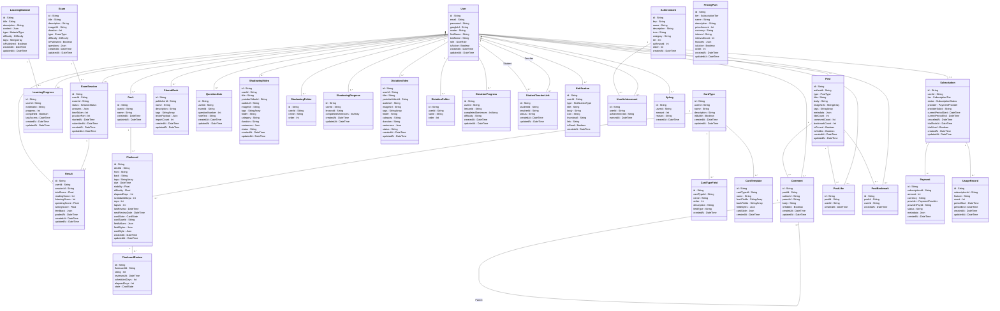

# Class Diagram — Core System & Community

```mermaid
classDiagram
    class User {
        id : String
        email : String
        password : String
        googleId : String
        avatar : String
        firstName : String
        lastName : String
        role : UserRole
        isActive : Boolean
        createdAt : DateTime
        updatedAt : DateTime
    }

    class Exam {
        id : String
        title : String
        description : String
        imageUrl : String
        duration : Int
        type : ExamType
        difficulty : Difficulty
        isPublished : Boolean
        questions : Json
        createdAt : DateTime
        updatedAt : DateTime
    }

    class ExamSession {
        id : String
        userId : String
        examId : String
        status : SessionStatus
        answers : Json
        timeTaken : Int
        practicePart : Int
        startedAt : DateTime
        submittedAt : DateTime
        createdAt : DateTime
        updatedAt : DateTime
    }

    class Result {
        id : String
        userId : String
        sessionId : String
        totalScore : Float
        readingScore : Int
        listeningScore : Int
        speakingScore : Float
        writingScore : Float
        feedback : Json
        gradedAt : DateTime
        createdAt : DateTime
        updatedAt : DateTime
    }

    class LearningMaterial {
        id : String
        title : String
        description : String
        content : Json
        type : MaterialType
        difficulty : Difficulty
        tags : StringArray
        isPublished : Boolean
        createdAt : DateTime
        updatedAt : DateTime
    }

    class LearningProgress {
        id : String
        userId : String
        materialId : String
        progress : Int
        completed : Boolean
        lastAccess : DateTime
        createdAt : DateTime
        updatedAt : DateTime
    }

    class Deck {
        id : String
        userId : String
        name : String
        createdAt : DateTime
        updatedAt : DateTime
    }

    class Flashcard {
        id : String
        deckId : String
        front : String
        back : String
        tags : StringArray
        due : DateTime
        stability : Float
        difficulty : Float
        elapsedDays : Int
        scheduledDays : Int
        reps : Int
        lapses : Int
        lastReview : DateTime
        nextReviewDate : DateTime
        cardState : CardState
        cardTypeId : String
        fieldValues : Json
        fieldStyles : Json
        cardStyle : Json
        createdAt : DateTime
        updatedAt : DateTime
    }

    class FlashcardReview {
        id : String
        flashcardId : String
        rating : Int
        reviewedAt : DateTime
        scheduledDays : Int
        elapsedDays : Int
        state : CardState
    }

    class CardType {
        id : String
        userId : String
        name : String
        description : String
        isBuiltIn : Boolean
        createdAt : DateTime
        updatedAt : DateTime
    }

    class CardTypeField {
        id : String
        cardTypeId : String
        name : String
        order : Int
        description : String
        fieldType : String
        createdAt : DateTime
    }

    class CardTemplate {
        id : String
        cardTypeId : String
        name : String
        frontFields : StringArray
        backFields : StringArray
        fieldStyles : Json
        cardStyle : Json
        createdAt : DateTime
    }

    class SharedDeck {
        id : String
        publisherId : String
        name : String
        description : String
        tags : StringArray
        lexonPayload : Json
        importCount : Int
        createdAt : DateTime
        updatedAt : DateTime
    }

    class QuestionNote {
        id : String
        userId : String
        examId : String
        questionNumber : Int
        noteText : String
        createdAt : DateTime
        updatedAt : DateTime
    }

    class ShadowingVideo {
        id : String
        userId : String
        title : String
        youtubeVideoId : String
        audioUrl : String
        imageUrl : String
        tags : StringArray
        folder : String
        category : String
        duration : String
        sentences : Json
        status : String
        createdAt : DateTime
        updatedAt : DateTime
    }

    class ShadowingFolder {
        id : String
        userId : String
        name : String
        order : Int
    }

    class ShadowingProgress {
        id : String
        userId : String
        lessonId : String
        completedSentences : IntArray
        createdAt : DateTime
        updatedAt : DateTime
    }

    class DictationVideo {
        id : String
        userId : String
        title : String
        youtubeVideoId : String
        audioUrl : String
        imageUrl : String
        tags : StringArray
        folder : String
        category : String
        duration : String
        sentences : Json
        status : String
        createdAt : DateTime
        updatedAt : DateTime
    }

    class DictationFolder {
        id : String
        userId : String
        name : String
        order : Int
    }

    class DictationProgress {
        id : String
        userId : String
        lessonId : String
        completedSentences : IntArray
        difficulty : String
        createdAt : DateTime
        updatedAt : DateTime
    }

    class StudentTeacherLink {
        id : String
        studentId : String
        teacherId : String
        status : String
        createdAt : DateTime
        updatedAt : DateTime
    }

    class Notification {
        id : String
        userId : String
        type : NotificationType
        title : String
        body : String
        icon : String
        thumbnail : String
        link : String
        isRead : Boolean
        createdAt : DateTime
    }

    class Achievement {
        id : String
        key : String
        name : String
        description : String
        icon : String
        category : String
        tier : Int
        xpReward : Int
        order : Int
        createdAt : DateTime
    }

    class UserAchievement {
        id : String
        userId : String
        achievementId : String
        earnedAt : DateTime
    }

    class XpLog {
        id : String
        userId : String
        amount : Int
        reason : String
        createdAt : DateTime
    }

    class Post {
        id : String
        authorId : String
        type : PostType
        title : String
        body : String
        imageUrls : StringArray
        tags : StringArray
        metadata : Json
        likeCount : Int
        commentCount : Int
        bookmarkCount : Int
        isPinned : Boolean
        isHidden : Boolean
        createdAt : DateTime
        updatedAt : DateTime
    }

    class Comment {
        id : String
        postId : String
        authorId : String
        parentId : String
        body : String
        isHidden : Boolean
        createdAt : DateTime
        updatedAt : DateTime
    }

    class PostLike {
        id : String
        postId : String
        userId : String
        createdAt : DateTime
    }

    class PostBookmark {
        id : String
        postId : String
        userId : String
        createdAt : DateTime
    }

    class Subscription {
        id : String
        userId : String
        tier : SubscriptionTier
        status : SubscriptionStatus
        provider : PaymentProvider
        providerSubId : String
        currentPeriodStart : DateTime
        currentPeriodEnd : DateTime
        canceledAt : DateTime
        trialEndsAt : DateTime
        trialUsed : Boolean
        createdAt : DateTime
        updatedAt : DateTime
    }

    class Payment {
        id : String
        subscriptionId : String
        amount : Int
        currency : String
        provider : PaymentProvider
        providerPayId : String
        status : String
        metadata : Json
        createdAt : DateTime
    }

    class UsageRecord {
        id : String
        subscriptionId : String
        feature : String
        count : Int
        periodStart : DateTime
        periodEnd : DateTime
        createdAt : DateTime
        updatedAt : DateTime
    }

    class PricingPlan {
        id : String
        tier : SubscriptionTier
        name : String
        description : String
        priceAmount : Int
        currency : String
        interval : String
        intervalCount : Int
        features : Json
        isActive : Boolean
        order : Int
        createdAt : DateTime
        updatedAt : DateTime
    }

    %% ── Exams & Learning Relationships ──
    Exam "1" -- "0..*" ExamSession
    User "1" -- "0..*" ExamSession
    User "1" -- "0..*" Result
    ExamSession "1" -- "0..1" Result
    LearningMaterial "1" -- "0..*" LearningProgress
    User "1" -- "0..*" LearningProgress

    %% ── Vocab Lab (Flashcards) Relationships ──
    User "1" -- "0..*" Deck
    Deck "1" -- "0..*" Flashcard
    Flashcard "1" -- "0..*" FlashcardReview
    CardType "1" -- "0..*" Flashcard
    CardType "1" -- "0..*" CardTypeField
    CardType "1" -- "0..*" CardTemplate
    User "1" -- "0..*" SharedDeck
    User "1" -- "0..*" QuestionNote

    %% ── Shadowing & Dictation Relationships ──
    User "1" -- "0..*" ShadowingVideo
    User "1" -- "0..*" ShadowingFolder
    User "1" -- "0..*" ShadowingProgress
    User "1" -- "0..*" DictationVideo
    User "1" -- "0..*" DictationFolder
    User "1" -- "0..*" DictationProgress

    %% ── Social & Community Relationships ──
    User "1" -- "0..*" StudentTeacherLink : Student
    User "1" -- "0..*" StudentTeacherLink : Teacher
    User "1" -- "0..*" Notification
    Achievement "1" -- "0..*" UserAchievement
    User "1" -- "0..*" UserAchievement
    User "1" -- "0..*" XpLog
    User "1" -- "0..*" Post
    Post "1" -- "0..*" Comment
    User "1" -- "0..*" Comment
    Comment "1" -- "0..*" Comment : Parent
    Post "1" -- "0..*" PostLike
    User "1" -- "0..*" PostLike
    Post "1" -- "0..*" PostBookmark
    User "1" -- "0..*" PostBookmark

    %% ── Subscriptions Relationships ──
    User "1" -- "0..1" Subscription
    Subscription "1" -- "0..*" Payment
    Subscription "1" -- "0..*" UsageRecord
```
