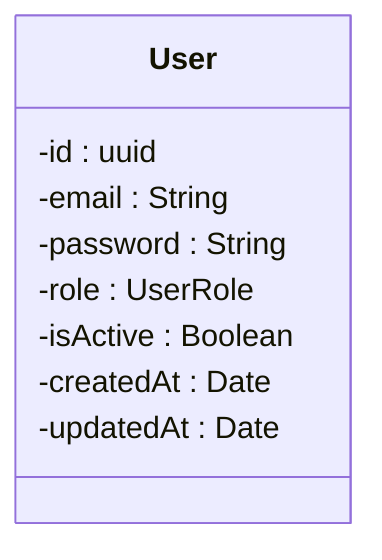

# Plan: Generate Mermaid Class Diagrams from Prisma Schema

## Goal
Parse `backend-core/prisma/schema.prisma` and generate **rendered class diagram images** (PNG/SVG) using Mermaid, styled to match the reference image: white boxes, `- attribute : Type` notation, thin black borders, association lines with multiplicity labels.

## Output Directory
`_thesis_paper/v3/`

---

## Phase 1 — Create the Prisma-to-Mermaid Generator Script

### Task
Create `_thesis_paper/v3/generate_mermaid.js` — a Node.js script that reads the Prisma schema and outputs `.mmd` (Mermaid) files.

### 1.1 Parse Models

Use regex to extract all `model` blocks:

```javascript
const modelRegex = /model (\w+) \{([\s\S]*?)\}/g;
```

For each model, extract fields. For each line inside the block:
- **Skip** lines that are empty, start with `//`, or start with `@@`
- **Skip** relation fields — a field is a relation if its type matches another model name (with or without `[]` or `?`). Build the full model name list first, then filter.
- Extract `fieldName` (first token) and `fieldType` (second token)
- Strip `?` from the type

### 1.2 Type Mapping

| Prisma Type | Mermaid Type |
|-------------|-------------|
| `String` | `String` |
| `String[]` | `StringArray` |
| `Int` | `Int` |
| `Int[]` | `IntArray` |
| `Float` | `Float` |
| `Boolean` | `Boolean` |
| `DateTime` | `Date` |
| `Json` | `Object` |
| Enum name (e.g. `UserRole`) | Keep as-is (e.g. `UserRole`) |

### 1.3 Parse Enums

Use regex: `enum (\w+) \{([\s\S]*?)\}` — extract enum names and their literal values. These are needed for TWO purposes:
1. Distinguish enum types from relation types during field parsing
2. **Render enums as `<<enumeration>>` stereotype boxes** (conventional UML notation)

For each enum, extract:
- Enum name (e.g. `UserRole`)
- All literal values (e.g. `STUDENT`, `ADMIN`, `INSTRUCTOR`), skipping comment lines (`//`)

### 1.4 Parse Relationships

For each model, find relation fields (fields whose type is another model name). Then find the `@relation(fields: [...], references: [...])` annotation to determine the FK side.

**Rules for multiplicity:**
- If model A has `fieldB ModelB @relation(fields: [bId])` → A is the FK side (many side), B is the parent (one side). Relationship: `B "1" -- "0..*" A`
- If model A has `fieldB ModelB?` with `@relation` → `B "1" -- "0..1" A`
- If model A has `fieldBs ModelB[]` with NO `@relation(fields:)` → this is the inverse side, skip (the other side will create the association)
- For self-relations (e.g., Comment → Comment via `parentId`), create `Comment "1" -- "0..*" Comment`

**Deduplication:** Track created associations as `Set<"ModelA-ModelB-fieldName">` to avoid duplicates.

### 1.5 Generate Mermaid Syntax

Output format per class (matches the reference image style with `-` prefix for private visibility):



> **IMPORTANT:** Use `-` prefix on every attribute to show private visibility, matching the reference image's `- attribute : Type` style.

#### Enum Output — Conventional UML `<<enumeration>>` Stereotype

Enums MUST be rendered as boxes with the `<<enumeration>>` stereotype, listing all literal values. This is the standard UML convention:

```mermaid
    class UserRole {
        <<enumeration>>
        STUDENT
        ADMIN
        INSTRUCTOR
    }

    class ExamType {
        <<enumeration>>
        FULL_TEST
        READING
        LISTENING
        SPEAKING
        WRITING
        PRACTICE
    }

    class Difficulty {
        <<enumeration>>
        BEGINNER
        INTERMEDIATE
        ADVANCED
    }
```

#### Enum Dependency Arrows

For each class attribute whose type is an enum, add a **dashed dependency arrow** (`..>`) from the class to the enum. This shows which classes use which enums:

```mermaid
    User ..> UserRole
    Exam ..> ExamType
    Exam ..> Difficulty
    ExamSession ..> SessionStatus
```

The script should auto-detect these by checking if an attribute's type matches an enum name.

#### Association (Relationship) Output

Output format for relationships:

```mermaid
    User "1" -- "0..*" ExamSession
    Exam "1" -- "0..*" ExamSession
    ExamSession "1" -- "0..1" Result
```

---

## Phase 2 — Split into Two Diagram Files with Category Grouping

> **CRITICAL:** Classes must be output in category order in the `.mmd` file. Mermaid's dagre layout engine places sequentially-defined and inter-connected classes near each other. Define all classes in a category group together, immediately followed by that group's internal relationships, before moving to the next category.

### Output Pattern (for each `.mmd` file)

```mermaid
classDiagram
    %% ══════════════ Category Name ══════════════
    class ModelA { ... }
    class ModelB { ... }
    class RelatedEnumX {
        <<enumeration>>
        ...
    }
    ModelA "1" -- "0..*" ModelB
    ModelA ..> RelatedEnumX

    %% ══════════════ Next Category ══════════════
    class ModelC { ... }
    ...
```

Place each category's **enums right after the classes that use them**, then the **relationships within that group**, then **cross-group relationships** (e.g., User → X) at the very end.

---

### File 1: `core-community.mmd` — Category Groups (in this order)

```javascript
const CORE_CATEGORIES = {
  // Group 1: Central entity — defined first
  'User & Auth': ['User'],

  // Group 2
  'Exam & Assessment': ['Exam', 'ExamSession', 'Result'],

  // Group 3
  'Learning Materials': ['LearningMaterial', 'LearningProgress'],

  // Group 4
  'Vocab Lab (Flashcards)': [
    'Deck', 'Flashcard', 'FlashcardReview',
    'CardType', 'CardTypeField', 'CardTemplate', 'SharedDeck',
  ],

  // Group 5
  'Question Notes': ['QuestionNote'],

  // Group 6
  'Shadowing': ['ShadowingVideo', 'ShadowingFolder', 'ShadowingProgress'],

  // Group 7
  'Dictation': ['DictationVideo', 'DictationFolder', 'DictationProgress'],

  // Group 8
  'Community & Social': ['Post', 'Comment', 'PostLike', 'PostBookmark'],

  // Group 9
  'Gamification': ['Achievement', 'UserAchievement', 'XpLog'],

  // Group 10
  'Notifications & Links': ['Notification', 'StudentTeacherLink'],

  // Group 11
  'Subscription & Billing': ['Subscription', 'Payment', 'UsageRecord', 'PricingPlan'],
};
```

**Enum placement in Core:**
| Enum | Place after group |
|------|-------------------|
| UserRole | User & Auth |
| ExamType, Difficulty | Exam & Assessment |
| SessionStatus | Exam & Assessment |
| MaterialType | Learning Materials |
| CardState | Vocab Lab |
| PostType | Community & Social |
| NotificationType | Notifications & Links |
| SubscriptionTier, SubscriptionStatus, PaymentProvider | Subscription & Billing |

---

### File 2: `ielts-foundation.mmd` — Category Groups (in this order)

```javascript
const IELTS_CATEGORIES = {
  // Group 1: Central entity — defined first
  'User & Profile': ['User', 'IeltsProfile'],

  // Group 2: Foundation — Vocabulary Books (4000 Essential Words)
  'Foundation Vocab Book': [
    'FoundationVocabBook', 'FoundationVocabUnit',
    'FoundationVocabItem', 'FoundationVocabExercise',
    'FoundationVocabQuestion', 'FoundationVocabProgress',
  ],

  // Group 3: Foundation — Vocabulary Lessons (standalone lessons)
  'Foundation Vocab Lesson': [
    'FoundationVocabLesson', 'FoundationVocabWord', 'Grammar',
  ],

  // Group 4: Foundation — Grammar Books (Cambridge Grammar in Use)
  'Foundation Grammar': [
    'FoundationGrammarBook', 'FoundationGrammarUnit',
    'FoundationGrammarExercise', 'FoundationGrammarProgress',
  ],

  // Group 5: Foundation — Pronunciation (IPA Chart)
  'Foundation Pronunciation': [
    'FoundationPronunciationSound', 'FoundationSoundExample',
    'FoundationPronunciationProgress', 'FoundationPronunciationAttempt',
  ],

  // Group 6: IELTS Basic (Skill-based learning)
  'IELTS Basic': [
    'IeltsBasicSkill', 'IeltsBasicLesson',
    'IeltsBasicListeningExercise', 'IeltsBasicReadingExercise',
    'IeltsBasicWritingExercise', 'IeltsBasicSpeakingExercise',
    'IeltsBasicProgress', 'IeltsBasicWritingAnswer',
  ],

  // Group 7: IELTS Advanced (Full practice tests)
  'IELTS Advanced': [
    'IeltsAdvancedListeningPart', 'IeltsAdvancedListeningSession',
    'IeltsAdvancedReadingPart', 'IeltsAdvancedReadingSession',
    'IeltsAdvancedWritingPrompt', 'IeltsAdvancedWritingSession',
    'IeltsAdvancedSpeakingPart', 'IeltsAdvancedSpeakingSession',
  ],
};
```

**Enum placement in IELTS:**
| Enum | Place after group |
|------|-------------------|
| UserRole | User & Profile |
| Difficulty | Foundation Vocab Lesson |
| PronunciationStatus | Foundation Pronunciation |
| PronunciationMastery | Foundation Pronunciation |

---

### Rules
- Output classes **in the exact category order** listed above — this is what makes dagre group them visually
- Add `%% ══════════════ Category Name ══════════════` comment separators between groups
- Place each group's **enums immediately after** the group's classes
- Place each group's **internal relationships** immediately after the enums
- Place **cross-group relationships** (e.g., `User "1" -- "0..*" Deck`) at the **end of the file**
- Only include relationships where BOTH ends are in the diagram's model set (User counts for both)
- Only include enums that are referenced by models in that diagram
- Only include enum dependency arrows (`..>`) for enums present in that diagram
- Each enum box should appear only ONCE per diagram, even if multiple classes reference it

---

## Phase 3 — Create Custom CSS Theme

### Task
Create `_thesis_paper/v3/mermaid-theme.css` to style the rendered diagrams to match the reference image.

```css
/* White background */
body { background: white; }

/* Class box styling — white fill, thin black border */
g.classGroup rect {
  fill: #ffffff !important;
  stroke: #000000 !important;
  stroke-width: 1px !important;
}

/* Class title (header) styling */
.classGroup .title {
  font-weight: bold !important;
  font-size: 14px !important;
  font-family: 'Arial', sans-serif !important;
}

/* Attribute text styling */
.classGroup text {
  font-family: 'Arial', sans-serif !important;
  font-size: 12px !important;
  fill: #000000 !important;
}

/* Divider line between title and attributes */
.classGroup line {
  stroke: #000000 !important;
  stroke-width: 1px !important;
}

/* Association lines */
.relation {
  stroke: #000000 !important;
  stroke-width: 1px !important;
}

/* Multiplicity labels on associations */
.cardinality {
  font-size: 11px !important;
  fill: #000000 !important;
  font-family: 'Arial', sans-serif !important;
}
```

### Also create `_thesis_paper/v3/mermaid-config.json`:

```json
{
  "theme": "base",
  "themeVariables": {
    "primaryColor": "#ffffff",
    "primaryBorderColor": "#000000",
    "primaryTextColor": "#000000",
    "lineColor": "#000000",
    "fontFamily": "Arial, sans-serif",
    "fontSize": "13px",
    "classText": "#000000"
  },
  "class": {
    "defaultRenderer": "dagre-wrapper"
  },
  "curve": "linear"
}
```

---

## Phase 4 — Render to PNG/SVG

### 4.1 Install Mermaid CLI

```powershell
cd _thesis_paper/v3
npm init -y
npm install @mermaid-js/mermaid-cli
```

### 4.2 Render Commands

```powershell
# Core & Community diagram
npx mmdc -i core-community.mmd -o core-community.png -C mermaid-theme.css -c mermaid-config.json -w 4000 -H 3000 -b white -s 2

npx mmdc -i core-community.mmd -o core-community.svg -C mermaid-theme.css -c mermaid-config.json -w 4000 -H 3000 -b white

# IELTS & Foundation diagram
npx mmdc -i ielts-foundation.mmd -o ielts-foundation.png -C mermaid-theme.css -c mermaid-config.json -w 5000 -H 3500 -b white -s 2

npx mmdc -i ielts-foundation.mmd -o ielts-foundation.svg -C mermaid-theme.css -c mermaid-config.json -w 5000 -H 3500 -b white
```

**Flag reference:**
- `-i` input file, `-o` output file
- `-C` custom CSS file
- `-c` config JSON file
- `-w` width, `-H` height (in pixels)
- `-b white` background color
- `-s 2` scale factor (for high-res PNG)

### 4.3 Add a render script to `package.json`

```json
{
  "scripts": {
    "generate": "node generate_mermaid.js",
    "render:core": "npx mmdc -i core-community.mmd -o core-community.png -C mermaid-theme.css -c mermaid-config.json -w 4000 -H 3000 -b white -s 2",
    "render:ielts": "npx mmdc -i ielts-foundation.mmd -o ielts-foundation.png -C mermaid-theme.css -c mermaid-config.json -w 5000 -H 3500 -b white -s 2",
    "build": "npm run generate && npm run render:core && npm run render:ielts"
  }
}
```

Run everything with: `npm run build`

---

## Phase 5 — Validate & Adjust

### Validation Checklist
1. ✅ Each `.mmd` file is valid Mermaid syntax (test with `npx mmdc -i file.mmd -o test.svg`)
2. ✅ All 54 models appear across the two diagrams
3. ✅ All 14 enums appear with `<<enumeration>>` stereotype and full literal values
4. ✅ Enum dependency arrows (`..>`) connect classes to their referenced enums
5. ✅ All relationships have correct multiplicity
6. ✅ No duplicate relationships or enum arrows
7. ✅ Rendered images have white boxes, thin borders, readable text
8. ✅ PNG images are high-resolution (at least 4000px wide)

### If diagrams are too crowded
- Increase `-w` and `-H` values
- Or further split into sub-diagrams (e.g., Core-Exam, Core-Flashcard, Core-Community, Core-Subscription)

---

## Expected Output Files

| File | Purpose |
|------|---------|
| `v3/generate_mermaid.js` | Parser script (Prisma → .mmd) |
| `v3/mermaid-theme.css` | Custom CSS for UML-like styling |
| `v3/mermaid-config.json` | Mermaid theme configuration |
| `v3/core-community.mmd` | Mermaid source — Core diagram |
| `v3/ielts-foundation.mmd` | Mermaid source — IELTS diagram |
| `v3/core-community.png` | Rendered Core diagram image |
| `v3/ielts-foundation.png` | Rendered IELTS diagram image |
| `v3/core-community.svg` | Vector version (for thesis) |
| `v3/ielts-foundation.svg` | Vector version (for thesis) |
| `v3/package.json` | npm scripts for build pipeline |

---

## Reference: All 14 Enums (with literals)

| Enum | Literals | Used By (Core) | Used By (IELTS) |
|------|----------|----------------|------------------|
| UserRole | STUDENT, ADMIN, INSTRUCTOR | User ✅ | User ✅ |
| ExamType | FULL_TEST, READING, LISTENING, SPEAKING, WRITING, PRACTICE | Exam ✅ | — |
| Difficulty | BEGINNER, INTERMEDIATE, ADVANCED | Exam, LearningMaterial ✅ | FoundationVocabLesson ✅ |
| SessionStatus | IN_PROGRESS, SUBMITTED, GRADING, GRADED, COMPLETED, ABANDONED, GRADING_FAILED | ExamSession ✅ | — |
| MaterialType | LESSON, VOCABULARY, GRAMMAR, PRACTICE, VIDEO, AUDIO | LearningMaterial ✅ | — |
| PronunciationStatus | PENDING, PROCESSING, COMPLETED, FAILED | — | FoundationPronunciationAttempt ✅ |
| PronunciationMastery | NEW, PRACTICING, MASTERED | — | FoundationPronunciationProgress ✅ |
| CardState | NEW, LEARNING, REVIEW, RELEARNING | Flashcard, FlashcardReview ✅ | — |
| SubscriptionTier | FREE, PREMIUM, PRO | Subscription, PricingPlan ✅ | — |
| SubscriptionStatus | ACTIVE, TRIALING, PAST_DUE, CANCELED, EXPIRED | Subscription ✅ | — |
| PaymentProvider | MOCK, VNPAY, STRIPE, MANUAL | Subscription, Payment ✅ | — |
| NotificationType | STREAK_MILESTONE, LESSON_COMPLETED, REVIEW_DUE, DECK_MASTERED, EXAM_GRADED, NEW_EXAM_AVAILABLE, DICTATION_COMPLETE, NEW_LESSON, SYSTEM_ANNOUNCEMENT, ACHIEVEMENT | Notification ✅ | — |
| PostType | STUDY_TIP, SCORE_ACHIEVEMENT, GENERAL | Post ✅ | — |

## Reference: Schema Location

`backend-core/prisma/schema.prisma` — 1453 lines, 54 models, 14 enums

## Reference: Existing Mermaid Diagrams (for relationship accuracy)

- `_thesis_paper/class-diagram-rest.md` — Core relationships reference
- `_thesis_paper/class-diagram-ielts.md` — IELTS relationships reference
